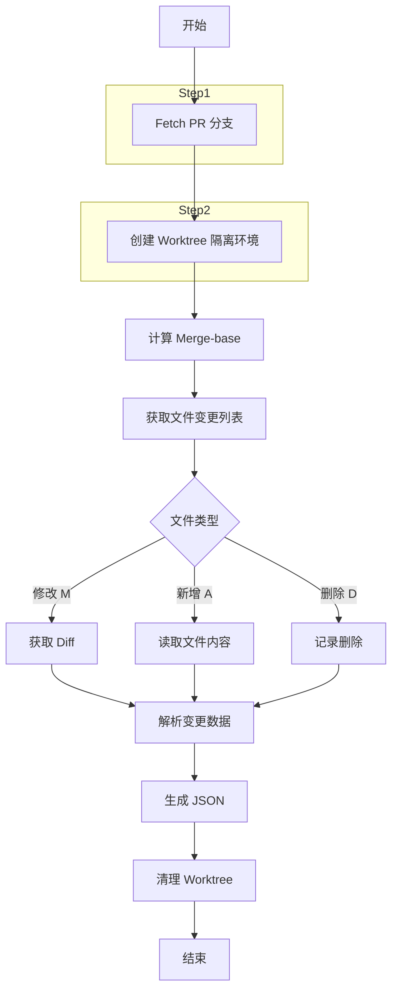
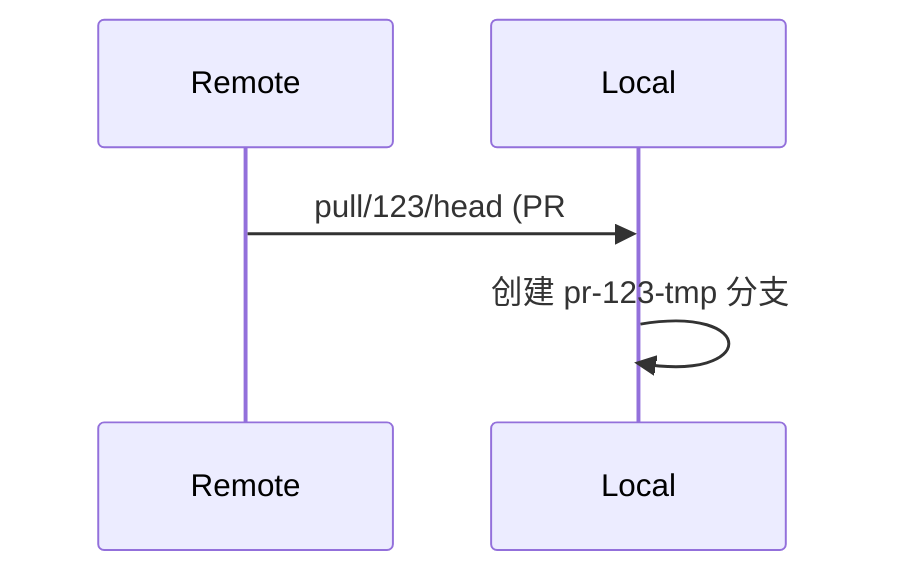
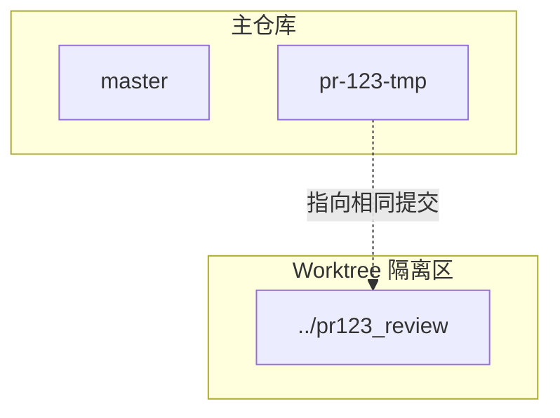
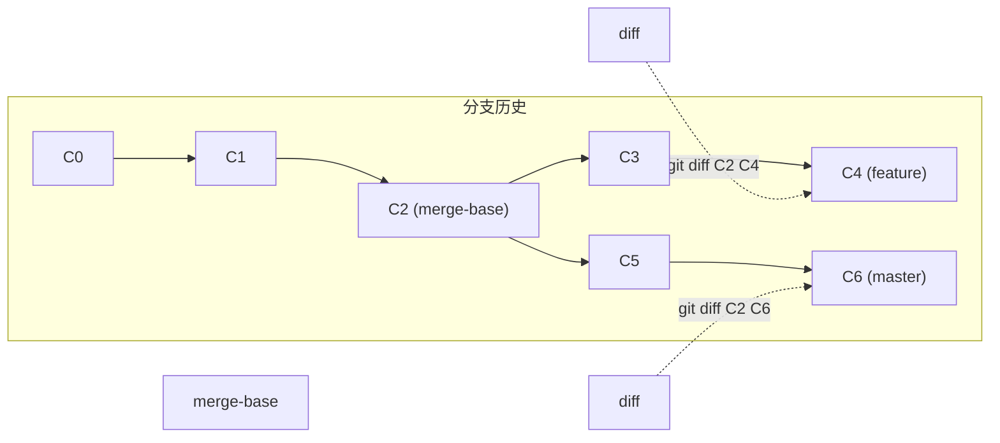
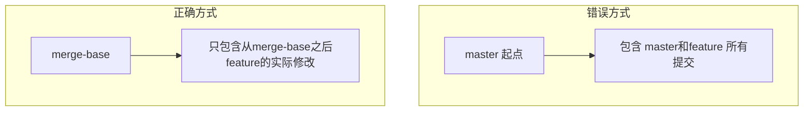
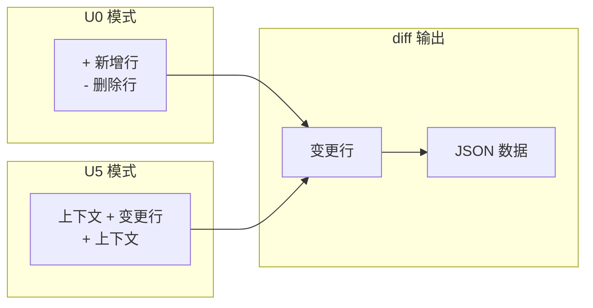
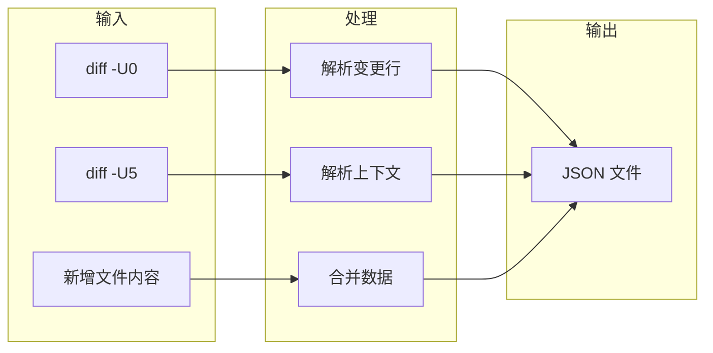

# review_prepare.py 原理介绍

## 背景问题

在自动化代码评审场景中，直接使用 Gitee API `get_diff_files` 获取 PR 的代码变更存在以下问题：

1. **代码不完整** - API 返回的 diff 可能缺少完整的上下文代码
2. **编码问题** - 特殊字符可能导致解析错误
3. **信息缺失** - 无法获取新增文件的完整内容

## 核心原理

`review_prepare.py` 通过 **Git Worktree** 机制，在本地仓库创建一个独立的临时工作区，直接利用 Git 命令获取完整、准确的代码变更信息。

## 完整工作流程



### Step 1: 获取 PR 分支

```bash
# Fetch PR 到本地临时分支
git fetch origin pull/123/head:pr-123-tmp
```



### Step 2: 创建 Worktree 隔离环境

```bash
# 创建独立工作区
git worktree add ../pr123_review pr-123-tmp
```



- 每个 PR 使用独立目录
- 并行分析不会互相干扰
- 完成后自动清理

### Step 3: 计算 Merge-base

```bash
# 找到共同祖先
git merge-base origin/master pr-123-tmp
```

这是获取准确 diff 的关键。

## Merge-base 原理

### 分支结构示例

```mermaid
gitGraph
   commit id: "C0"
   commit id: "C1"
   commit id: "C2"
   branch feature
   commit id: "C3"
   commit id: "C4"
   checkout master
   commit id: "C5"
   commit id: "C6"
```

### Merge-base 作用



### 为什么需要 Merge-base？

| 比较方式 | 说明 |
|---------|------|
| `git diff master feature` | 从 master 起点比较，包含 feature 全部历史 |
| `git diff merge-base feature` | **从共同祖先比较，只包含实际变更** |



## Step 4: 获取文件变更

### 4.1 获取变更文件列表

```bash
git diff --name-status merge-base pr-123-tmp
```

输出格式：
```
M       src/main.py
A       src/new_file.py
D       src/delete.py
```

### 4.2 获取修改文件的具体变更

```bash
# -U0: 仅变更行（精确）
git diff -U0 merge-base pr-123-tmp -- src/main.py

# -U5: 前后5行上下文（便于理解）
git diff -U5 merge-base pr-123-tmp -- src/main.py
```



### 4.3 处理新增文件

```bash
# 直接读取文件完整内容
cat src/new_file.py
```

## Step 5: 生成 JSON



## Step 6: 清理资源

```bash
# 清理 Worktree
git worktree remove ../pr123_review

# 删除临时分支
git branch -D pr-123-tmp
```

## 完整 Git 命令序列

```bash
# 1. 获取 PR 分支
git fetch origin pull/123/head:pr-123-tmp

# 2. 创建 Worktree
git worktree add ../pr123_review pr-123-tmp

# 3. 计算 Merge-base
MB=$(git merge-base origin/master pr-123-tmp)

# 4. 获取变更文件列表
git diff --name-status $MB pr-123-tmp

# 5. 获取具体文件变更
git diff -U0 $MB pr-123-tmp -- filename.py
git diff -U5 $MB pr-123-tmp -- filename.py

# 6. 清理资源
git worktree remove ../pr123_review
git branch -D pr-123-tmp
```

## 输出格式

生成的 JSON 文件包含：

```json
[
  {
    "file": "src/main.py",
    "added_lines": [
      {"line": 10, "code": "def new_function():"},
      {"line": 11, "code": "    pass"}
    ],
    "deleted_lines": [
      {"line": 5, "code": "def old_function():"}
    ],
    "context": [
      {"line": 8, "code": "class MyClass:"},
      {"line": 9, "code": "    pass"}
    ]
  }
]
```

## 优势总结

| 对比项 | API get_diff_files | review_prepare.py |
|--------|-------------------|-------------------|
| 代码完整性 | 部分缺失 | 完整获取 |
| 上下文 | 无 | 可配置 |
| 新增文件 | 仅 diff | 完整内容 |
| 编码处理 | 一般 | 优化处理 |
| 准确性 | 依赖 API | 基于 Git 命令 |

通过本地 Git 环境确保了代码变更的准确性，是自动化代码评审的可靠数据来源。
