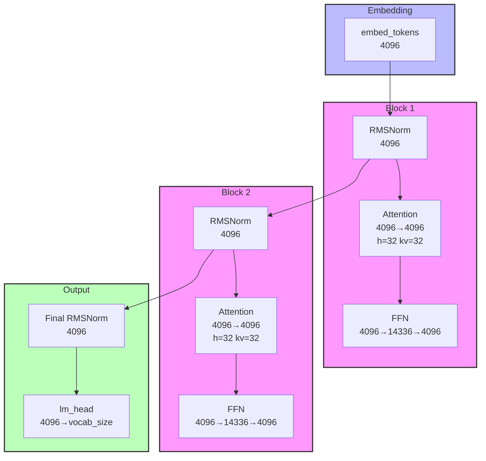

# Model Architecture Diagram Skill - Implementation Plan

> **For agentic workers:** REQUIRED SUB-SKILL: Use superpowers:subagent-driven-development (recommended) or superpowers:executing-plans to implement this plan task-by-task. Steps use checkbox (`- [ ]`) syntax for tracking.

**Goal:** Create a Claude Code skill that generates professional model architecture diagrams (PNG/SVG/Mermaid) from HuggingFace models, local model files, or user-defined YAML configurations.

**Architecture:** This skill is primarily a prompt-based AI skill (SKILL.md) that instructs the AI on how to parse model configs, match against templates, generate Mermaid syntax, and render outputs. Template YAML files provide structure definitions. Helper scripts handle rendering.

**Tech Stack:** YAML (templates), Mermaid CLI (`@mermaid-js/mermaid-cli`), HuggingFace Hub API, Claude Code Skill format.

---

## File Structure

```
create_model_arch_diagram/
├── SKILL.md                              # Skill main entry (AI instructions)
├── docs/
│   └── superpowers/
│       ├── specs/
│       │   └── 2026-03-21-create_model_arch_diagram-design.md
│       └── plans/
│           └── 2026-03-21-create_model_arch_diagram-implementation-plan.md
├── templates/                            # Model structure templates
│   ├── llama/
│   │   └── common.yaml
│   ├── mistral/
│   │   └── common.yaml
│   ├── qwen/
│   │   └── common.yaml
│   ├── glm/
│   │   └── common.yaml
│   ├── baichuan/
│   │   └── common.yaml
│   ├── mimo/
│   │   └── common.yaml
│   ├── kimi/
│   │   └── common.yaml
│   ├── minimax/
│   │   └── common.yaml
│   └── gpt-oss/
│       └── common.yaml
└── scripts/
    └── render_mermaid.sh                 # Helper script for Mermaid CLI rendering
```

---

## Task 1: Create SKILL.md

**Files:**
- Create: `create_model_arch_diagram/SKILL.md`

- [ ] **Step 1: Write SKILL.md with complete AI instructions**

The SKILL.md should contain:
1. Skill description and purpose
2. Invocation syntax: `/create_model_arch_diagram <model> [--format png,svg,mmd] [--output /path/to/dir]`
3. Input handling:
   - HuggingFace model ID parsing
   - Local file path handling
   - YAML config direct input
4. Template matching logic for each model family
5. Mermaid syntax generation instructions (with reference examples)
6. AI auto-completion rules (norm type, activation, residual connection)
7. Shape calculation rules (including GQA handling)
8. Output file naming convention
9. Mermaid CLI rendering instructions
10. Example invocations

**Mermaid Syntax Generation (reference examples):**

For a 2-layer LLaMA-style model with hidden_size=4096:



Key formatting rules:
- Use `subgraph` for logical groups (Embedding, Block_N, Output)
- Label layers with type + shape: `Attention<br/>4096→4096<br/>h=32 kv=32`
- For GQA, show `h=num_attention_heads kv=num_key_value_heads`
- Use `direction TB` for top-to-bottom within blocks
- Show residual connections implicitly via the flow

**GQA (Grouped Query Attention) handling:**
- If `num_key_value_heads < num_attention_heads`, render with separate kv_heads count
- If `num_key_value_heads == num_attention_heads`, omit kv display

- [ ] **Step 2: Verify SKILL.md structure is complete**

Check that all sections from the design spec are covered.

- [ ] **Step 3: Commit**

```bash
git add create_model_arch_diagram/SKILL.md
git commit -m "feat: add SKILL.md entry file"
```

---

## Task 2: Create Template YAML Files

**Files:**
- Create: `templates/llama/common.yaml`
- Create: `templates/mistral/common.yaml`
- Create: `templates/qwen/common.yaml`
- Create: `templates/glm/common.yaml`
- Create: `templates/baichuan/common.yaml`
- Create: `templates/mimo/common.yaml`
- Create: `templates/kimi/common.yaml`
- Create: `templates/minimax/common.yaml`
- Create: `templates/gpt-oss/common.yaml`

- [ ] **Step 1: Create llama/common.yaml**

```yaml
# LLaMA family template
model_type: llama
family: llama

block:
  - type: attention
    components:
      - q_proj
      - k_proj
      - v_proj
      - o_proj
  - type: ffn
    components:
      - gate_proj
      - up_proj
      - down_proj

stack:
  num_layers_key: num_hidden_layers
  pattern: [block] × N

residual: pre-norm
norm: rmsnorm
activation: silu

# Module connections
input: embed_tokens
output: lm_head
```

- [ ] **Step 2: Create remaining model family templates**

For each family, create a `common.yaml` with:
- `model_type`: identifier for the family
- `family`: directory name
- `block`: definition of transformer block structure
- `stack`: layer stacking pattern
- `residual`: residual connection type (pre-norm / post-norm)
- `norm`: default norm type
- `activation`: default activation function
- `input`: input embedding module name
- `output`: output head module name
- `kv_heads`: (optional) number of key/value heads for GQA support

**Specific guidance for each model family:**

```yaml
# mistral/common.yaml - LLaMA derivative with Grouped Query Attention
model_type: mistral
family: mistral
# Uses GQA (num_key_value_heads < num_attention_heads)
kv_heads_key: num_key_value_heads

# qwen/common.yaml - LLaMA derivative with SiLU activation
model_type: qwen
family: qwen
# Standard LLaMA block structure

# glm/common.yaml - GLM-specific block structure
model_type: glm
family: glm
# GLM uses GLMBlock with specific attention (SelfAttention + MultiHeadAttention)
# Post-norm residual pattern

# baichuan/common.yaml - LLaMA derivative
model_type: baichuan
family: baichuan
# Standard LLaMA structure

# mimo/common.yaml - MiniMax proprietary
model_type: mimo
family: mimo
# Standard transformer block structure

# kimi/common.yaml - MoE-style or standard transformer
model_type: kimi
family: kimi
# If MoE: add MoE layers ( gating + experts)
# If standard: similar to LLaMA

# minimax/common.yaml - MiniMax proprietary
model_type: minimax
family: minimax
# Standard transformer block structure

# gpt-oss/common.yaml - Standard GPT structure
model_type: gpt_oss
family: gpt_oss
# Uses GELU activation, post-norm residual
```

- [ ] **Step 3: Commit**

```bash
git add templates/
git commit -m "feat: add model family templates"
```

---

## Task 3: Create Helper Scripts

**Files:**
- Create: `scripts/render_mermaid.sh`

- [ ] **Step 1: Write render_mermaid.sh script**

```bash
#!/bin/bash
# Usage: ./render_mermaid.sh <input.mmd> <output.png> [output.svg]
# Requires: @mermaid-js/mermaid-cli installed globally or npx

INPUT=$1
OUTPUT_PNG=$2
OUTPUT_SVG=$3

if command -v mmdc &> /dev/null; then
    MMDC_CMD="mmdc"
elif command -v npx &> /dev/null; then
    MMDC_CMD="npx @mermaid-js/mermaid-cli"
else
    echo "Error: mermaid-cli not found"
    exit 1
fi

# Render PNG
$MMDC_CMD -i "$INPUT" -o "$OUTPUT_PNG" -b transparent -w 1920

# Render SVG if requested
if [ -n "$OUTPUT_SVG" ]; then
    $MMDC_CMD -i "$INPUT" -o "$OUTPUT_SVG" -b transparent -w 1920 -f svg
fi
```

- [ ] **Step 2: Make script executable**

```bash
chmod +x scripts/render_mermaid.sh
```

- [ ] **Step 3: Commit**

```bash
git add scripts/render_mermaid.sh
git commit -m "feat: add mermaid rendering helper script"
```

---

## Task 4: Create Initial Instance Templates

**Files:**
- Create: `templates/llama/llama-2-7b.yaml` (example instance)
- Create: `templates/llama/llama-3-8b.yaml` (example instance)

- [ ] **Step 1: Create llama-2-7b.yaml instance template**

```yaml
# Generated from meta-llama/Llama-2-7b
model_type: llama2
family: llama
model_name: llama-2-7b
source: meta-llama/Llama-2-7b

config:
  hidden_size: 4096
  num_hidden_layers: 32
  intermediate_size: 11008
  num_attention_heads: 32
  num_key_value_heads: 32
  activation: silu
  rms_norm_eps: 1.0e-6
  vocab_size: 32000
  rope_theta: 10000.0

# Template reference (inherits from common.yaml)
template: llama/common.yaml
```

- [ ] **Step 2: Create llama-3-8b.yaml instance template**

```yaml
# Generated from meta-llama/Meta-Llama-3-8B
model_type: llama3
family: llama
model_name: llama-3-8b
source: meta-llama/Meta-Llama-3-8B

config:
  hidden_size: 4096
  num_hidden_layers: 32
  intermediate_size: 14336
  num_attention_heads: 32
  num_key_value_heads: 8
  activation: silu
  rms_norm_eps: 1.0e-5
  vocab_size: 128256
  rope_theta: 500000.0

template: llama/common.yaml
```

- [ ] **Step 3: Commit**

```bash
git add templates/llama/
git commit -m "feat: add LLaMA instance templates"
```

---

## Task 5: Verify Complete Skill Structure

- [ ] **Step 1: Verify all files exist**

```bash
ls -la create_model_arch_diagram/
ls -la create_model_arch_diagram/templates/
ls -la create_model_arch_diagram/templates/llama/
ls -la create_model_arch_diagram/scripts/
```

- [ ] **Step 2: Verify SKILL.md has all required sections**

Check coverage:
- [ ] Invocation syntax
- [ ] HuggingFace parsing
- [ ] Local file parsing
- [ ] YAML config handling
- [ ] Template matching
- [ ] Mermaid generation
- [ ] AI auto-completion
- [ ] Shape calculation
- [ ] Output formats
- [ ] Examples

- [ ] **Step 3: Final commit**

```bash
git add -A
git commit -m "feat: complete create_model_arch_diagram skill structure"
```

---

## Verification Commands

After implementation, verify the skill works by:

```bash
# Check skill structure
ls -R create_model_arch_diagram/

# Verify SKILL.md content
head -50 create_model_arch_diagram/SKILL.md

# Verify templates are valid YAML
python3 -c "import yaml; yaml.safe_load(open('templates/llama/common.yaml'))"

# Verify render script syntax
bash -n scripts/render_mermaid.sh && echo "Script syntax OK"
```

---

## Dependencies

- Node.js (for mermaid-cli via npx or global install)
- `huggingface_hub` Python package (optional, for programmatic downloads)
- Standard Unix tools (bash, curl)
