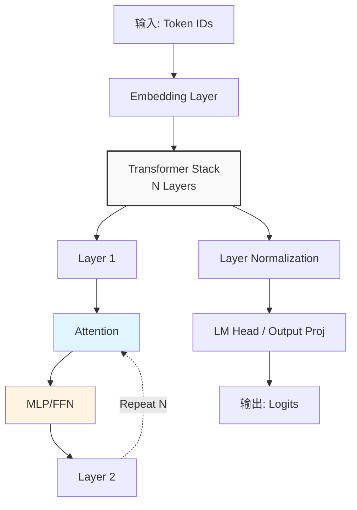

# 模型方案设计文档（模板）

**修订记录**

| 日期 | 修订版本 | 修改描述 | 作者 |
| :---: | :---: | :---: | :---: |
| yyyy-mm-dd | 1.0 | 初稿 | 姓名/工号 |
| yyyy-mm-dd | 1.1 | 新增xx特性 | 姓名/工号 |

## 1. 模型需求背景

> **本章说明**：描述模型推理的业务场景、部署环境硬件配置、输入输出流量特征和性能目标。需明确芯片类型、拓扑结构、显存限制、序列长度分布和时延/吞吐要求，为后续架构设计和性能预估提供依据。

* **业务场景**：例如：数据生产、 盘古模型上线服务、 Qwen开源新模型。详细描述业务场景价值和需求
* **硬件平台**：
    * **芯片类型**：如 910B 8卡、 910C 64卡、 910D单卡
    * **拓扑结构**：4台 RoCE 组网、 910C超节点
    * **显存限制**：单卡可用显存 (GB) 及带宽 (GB/s)
* **流量分布特征**：
    * **典型 Sequence Length**：输入长度、输出长度、分布具体信息
    * **最大上下文**：如 32K, 128K
* **性能目标**：
    * **TTFT (首字时延)**：多长序列达成TTFT $\le$ XX ms（单卡吞吐$\ge$ XX tokens/s）
    * **TPOT (Token间时延)**：多少并发目标 $\le$ XX ms（单卡吞吐$\ge$ XX tokens/s）

---

## 2. 模型架构

> **本章说明**：详细描述模型的架构设计，包括参数规模、核心组件配置（Attention、MoE、Normalization、Block）、模型配置参数、与基准模型的差异对比，以及架构流程图。需要提供完整的JSON配置文件和架构图，明确模型的核心特性。

### 2.1 核心架构
* **参数规模**：
* **核心配置**：
    * **Attention**：
    * **MoE**: 
    * **Normalization**：
    * **Block**: 
* **权重和代码链接**：xxx
* **架构差异对比**：
    * 相对于基准模型 (如 DeepSeek、前一代模型) 的修改点、与其它模型的相似点。
    * 是否存在逻辑分支（如 MoE 的 Router 逻辑）。

### 2.2 模型配置参数

---

## 3. 性能预估和性能拆解

> **本章说明**：提供Decode和Prefill两个阶段的性能预估，包括吞吐随时延变化曲线、TTFT随序列长度变化曲线。详细拆解单层中各算子的理论可达和实测值占比，分析显存占用（权重、KV Cache、激活值、系统开销），并给出不同部署方案和量化方案下的最大序列长度支持。

### 3.1 Decode 阶段性能预估

预计卡xxms时延可以达到xxxTPS，卡xxms时延可以达到xxxTPS，卡xxms时延可以达到xxxTPS

### 3.2 Prefill 阶段性能预估

预计卡xxms时延可以达到xxxTPS，卡xxms时延可以达到xxxTPS，卡xxms时延可以达到xxxTPS

### 3.2 性能拆解

| 模块 | 算子 | 理论可达 | 实测值 | 理论可达占比 | 实测占比 |
| :--- | :--- | :--- | :--- | :--- | :--- |

### 3.3 显存分析

**模型配置**：总参数xxB，激活参数约xxB，Hidden Size xx，GQA (xxH/xxKV)，Attention类型：MLA

Prefill

| 部署方案 | 量化方案 | 单卡权重(GB) | 系统开销(GB) | Prefill激活(GB) | 剩余显存(GB) | 输入序列最大长度(tokens) |
| :--- | :--- | :--- | :--- | :--- | :--- | :--- |

Decode

| 部署方案 | 量化方案 | 单卡权重(GB) | 系统开销(GB) | 剩余显存(GB) | 单token KV (KB) | 并发数 | 最大上下文长度 |
| :--- | :--- | :--- | :--- | :--- | :--- | :--- | :--- |

---

## 4. 整体部署方案

> **本章说明**：设计模型的并行策略和部署方案，包括各子模块的并行方式（TP/EP/SP/PP）和通信方式、量化方案选择（W8A8/W4A16/FP8/KV Cache Quant）、算子融合设计、以及模型侧优化方案（FlashComm3、预取、CV多流、SuperKernel等），并预估各优化方案的收益。

### 4.1 模型并行设计

| 子模块 | 并行方式 | 通信方式 | 原因 |
| :--- | :--- | :--- | :--- |
| **Q_Down/KV_Down** | SP (Sequence Parallel) | AllGather |  |
| **Q_Up/KV_Up/FA (FlashAttention)** | TP (Tensor Parallel) | AllReduce |  |
| **Oproj** | SP8TP2 | AllGather + AllReduce |  |
| **MoE** | EP (Expert Parallel) | AlltoAll |  |

### 4.2 量化方案
* **量化算法**：每个模块使用的量化方法，比如GMM使用W8A8量化、KVDown矩阵不做量化
* **量化粒度**：每个模块的量化粒度，比如KV cache使用pertile-64量化，GMM使用pertoken量化
* **精度对齐目标**：对齐数据集、对齐指标等

### 4.3 算子需求与融合优化
* **融合算子**：如 Dequant外抛与DSG融合算子, RotaryEmbedding 融合

### 4.4 模型侧优化方案
* **FlashComm3 方案**：介绍方案细节、预估收益
* **预取方案**: 介绍方案细节、预估收益
* **CV多流**: 介绍方案细节、预估收益
* **SuperKernel**: 介绍方案细节、预估收益

---

## 5. 模型极致优化方案

> **本章说明**：针对模型性能瓶颈设计极致优化方案，包括定制算子设计（如MLAprolog融合算子、Matmul tiling优化）和新方案设计（如Attention分离、KVP方案），需要说明优化原因、具体实现方法和预期收益。

### 5.1 极致性能算子设计
* **MLAprolog融合算子子**：介绍融合算子设计原因，预期收益
* **Matmul tiling修改等**：介绍tiling修改原因，修改方法名，预计收益

### 5.2 新方案设计
* **Attention分离**：介绍方案细节、预估收益
* **KVP**：介绍方案细节、预估收益

---

## 6. 框架方案设计或需求

> **本章说明**：描述推理框架的设计和需求，包括KV Cache的管理策略（不同类型KV cache的管理和设计）、框架功能需求（如Prefix Caching）、入图支持（aclgraph执行）等，为框架开发提供明确需求。

* **KV Cache 管理**：不同类型KV cache的管理和设计
* **框架需求**：Prefix Caching 等需求。
* **入图**：支持aclgraph执行的需求描述。

---

## 7. Layer 和模型脚本设计

> **本章说明**：描述推理脚本的类设计和模块化封装方案，包括类继承关系图、各核心组件（Attention、prefetch、FusedMoE等）的模块化设计、权重映射规则（HuggingFace权重到推理引擎的转换），确保代码结构的清晰和可维护性。

* **类继承关系**：类继承关系图
* **模块化封装**：Attention, prefetch, FusedMoE等的设计。

---

## 8. 性能和精度测试及验收标准

> **本章说明**：定义性能和精度的测试方法和验收标准，包括TPOT/TTFT/吞吐测试方法、打点方式、测试数据集、mtp接受率测试方法、以及精度评测方法（评测数据集、评测标准），确保模型推理性能和精度满足业务要求。

* **TPOT/TTFT/吞吐测试方法**：描述详细的性能数据测试方法（测试数据集、打点方式等）
* **mtp接受率**：描述投机接受率的测试方法（打点方式、测试数据集）
* **精度评测**：描述精度评测方法（评测数据集、评测标准）

