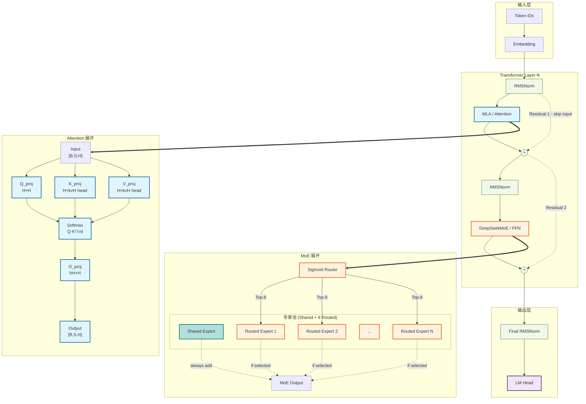

# LLM Architecture Generator

## Invocation

```
/llm-arch-generator <model> [-v|-vv] [--format png,svg,mmd] [--output /path/to/dir]
```

**IMPORTANT: This skill ALWAYS uses `-vv` (expanded view) by default.** The expanded view shows detailed internal structure including projection layers, router mechanisms, and expert pools. Do NOT use `-v` unless the user explicitly requests a simple/collapsed view.

**Natural language mapping:**

| User says | Interpreted as |
|-----------|---------------|
| "Draw/plot/generate architecture of {model}" | `-vv` (expanded, detailed) |
| "Simple/high-level/macro/collapsed view" | `-v` (collapsed) — only if explicitly requested |
| "Detailed/expanded/with projections" | `-vv` (expanded, detailed) |
| "Save to {path}" | `--output /path` |

**Parameters:**

| Parameter | Description | Default |
|-----------|-------------|---------|
| `model` | HuggingFace ID, local path, or YAML config | Required |
| `-vv` | Level 2: **EXPANDED** detailed view with all internals | **ALWAYS DEFAULT** |
| `-v` | Level 1: collapsed blocks (only if user explicitly asks) | — |
| `--format` | Output formats | png,svg,mmd |
| `--output` | Output directory | CWD |

### Examples

```bash
# ALWAYS expanded detailed view by default
/llm-arch-generator moonshotai/Kimi-K2.5

# Expanded view for DeepSeek V3 (MoE architecture)
/llm-arch-generator deepseek-ai/DeepSeek-V3-Base -vv

# Only use collapsed view if explicitly requested
/llm-arch-generator gpt2 -v

# With PNG output
/llm-arch-generator Qwen/Qwen2-7B --format png --output ./diagrams

# Natural language
/llm-arch-generator Draw the architecture of LLaMA-3 and show me the projections
```

---

## Workflow

### Step 0: Choose Data Source
**Always ask the user to choose how to obtain the model configuration** before proceeding:

1. **HuggingFace** — Search and download model config from HuggingFace Hub (requires network, most accurate — analyzes actual model.py code)
2. **Built-in Templates** — Match model name to `templates/{family}/` YAML files (no network needed, fast fallback)

> **Built-in Templates** (`templates/` directory): Contains pre-built YAML configs for 10 model families (llama, qwen, deepseek, kimi, glm, baichuan, mistral, minimax, mimo, gpt-oss) covering 37+ models. If a specific model is not found, the AI uses `common.yaml` to infer structure from family conventions.

### Step 1: Resolve Model ID
If user provides a model name (e.g., "Kimi-K2.5", "LLaMA-3", "DeepSeek V3"), search for the HuggingFace model ID first:
- Use web search to find the official HuggingFace repository
- Common patterns: `moonshotai/Kimi-K2.5`, `meta-llama/Llama-3-8b`, `deepseek-ai/DeepSeek-V3`, `Qwen/Qwen2-7B`
- If multiple matches exist, use the official/original model

### Step 2: Download Model Files
Once resolved, download via `scripts/download_model.py`:
```bash
python scripts/download_model.py <model_id>
```
- Scans repo with `list_repo_files()` to find ALL `modeling_*.py` files
- Caches to `~/.cache/llm_arch_generator/{model_id}/`
- **Select the correct modeling file**: Read `config.json` → get `auto_map["AutoModel"]` (e.g., `"modeling_kimi_k25.KimiK25ForConditionalGeneration"`). Extract the file prefix before the `.` (e.g., `modeling_kimi_k25`). Pick the `modeling_*.py` whose filename contains this prefix (case-insensitive). If none match, fall back to the first file.

### Step 3: Analyze Model Structure

**Branch A — HuggingFace (from Step 1/2):**
Read model.py to build the module tree and trace the forward() path:
- Identify all major modules (attention, FFN, MoE, router, norms)
- Detect residual connections from actual code analysis (look for `residual = hidden_states`, `hidden_states + residual`, `hidden_states = hidden_states + other`)
- Calculate tensor shapes from config.json + weight definitions

**Branch B — Built-in Templates:**
1. **Match model to template**: Extract model family from name (e.g., "Qwen3-32B" → `qwen/`). Try exact match: `templates/{family}/{model-name}.yaml`. Fall back to scanning `templates/*/common.yaml` for matching `model_type`.
2. **Read template**: Load matched YAML + its `common.yaml`. Merge configs (model YAML overrides common.yaml).
3. **Parse architecture**: Extract `hidden_size`, `num_layers`, `attention_type`/`attention_impl`, `ffn_type`/`moe`, `kv_heads_key`, `vision` config, etc.
4. **Infer internals**: Use `block` definitions from common.yaml (attention components: q_proj/k_proj/v_proj/o_proj; ffn components: gate_proj/up_proj/down_proj) combined with `config` values to determine tensor shapes.

### Step 4: Generate Mermaid Diagram (Level 2 Expanded)
**ALWAYS generate expanded view (`graph TD`) with maximum detail.** The diagram must show:

**Required elements for expanded view:**
1. **Embedding layer** with vocab size and hidden dimension
2. **Input RMSNorm** (if present before first layer)
3. **Attention internals**: Q/K/V projections, rotary embedding (RoPE), softmax, O projection
4. **MLP/FFN internals**: gate_proj, up_proj, down_proj (or DeepseekV3MLP structure)
5. **MoE internals**: Router (with activation function and top-K), Shared Expert, Routed Expert Pool
6. **All residual connections** shown as dashed `-.->` arrows with labels
7. **Final RMSNorm and LM Head**
8. **For multimodal models**: Vision encoder, Projector

**Graph structure rules:**
- Use `graph TD` (top-down) layout
- Use `==>` for expansion arrows (show "internals" of a module)
- Use `-.->` for residual connections (dashed arrows)
- Use `subgraph` with `direction TB` for module groupings
- Apply color classes from the Color Conventions section
- **DO NOT include a legend** — colors are self-explanatory via node labels
- **DO NOT use layer-index markers as nodes** (e.g., `Out_L`, `h_l`, `layer_out`) — these are comments, not graph nodes. Use subgraph-level connections (e.g., `Input_Stage --> Transformer_Layer`) to show data flow between stages

### Step 5: Verify Mermaid Diagram (Syntax + Semantic)

**After generating the `.mmd` file, you MUST run both syntax and semantic checks.**

#### 5a. Syntax Checks

Run the mermaid CLI to catch parse errors:
```bash
bash scripts/render_mermaid.sh <output_file>.mmd 2>&1
# Parse error → fix syntax issues before proceeding
```

Then verify manually:
1. **No duplicate node IDs** — each ID must be unique within the diagram
2. **All referenced nodes defined** — every node after `-->` / `==>` / `-.->` must have a corresponding definition
3. **Subgraph labels quoted** — labels with special chars must use `"label"` format
4. **classDef names match** — every `:::className` must have a corresponding `classDef className`

#### 5b. Connectivity Verification

Run the connectivity checker to detect undefined references, orphan nodes, and broken paths:
```bash
python scripts/verify_mermaid.py <output_file>.mmd --verbose
```

**Real issues to fix:**
- `UNDEFINED (node used but not defined)` — a node ID is referenced in an edge but never defined
- `DEAD PATH: 'X' is not reachable from Input_Stage` — output stage cannot be reached from input

**Expected false positives (ignore):**
- `ORPHAN (no outgoing)` on nodes inside subgraphs — subgraph-internal nodes may appear orphaned because edges within subgraphs don't propagate through subgraph container IDs in the checker
- `DEAD END` on expansion target subgraphs (any node matching `*_Detail`, `Hybrid_*`, `DSA_*`, `Linear_*`, `Gated_*`) — `==>` expand arrows are visual-only and don't count as outgoing edges
- `ORPHAN` / `ISOLATED` on subgraph container IDs (`Input_Stage`, `Transformer_Layer`, `Output_Stage`) — these are transparent containers; use subgraph-level connections (`Input_Stage --> Transformer_Layer`) for data flow

#### 5c. Semantic Checks (Module Internals)

After connectivity is clean, verify each expanded module is **fully connected**:

**FFN / Dense MLP:**
- `gate_proj` and `up_proj` must **BOTH** connect to the activation (e.g., SiLU/GELU)
- The activation output must connect to `down_proj`
- FFN without both gate+up connections is incomplete (common bug)

**MoE Expert Pool:**
- `Router` must connect to **every** expert in the pool (including the ellipsis `...` node if present)
- `Shared Expert` must have a **dashed** `-.-> |always add|` connection to the merge point
- Each `Routed Expert` must have a dashed `-.-> |if selected|` connection

**Attention (Standard / GQA / MLA):**
- `Q_proj`, `K_proj`, `V_proj` must **ALL** connect to `Softmax`
- `O_proj` must receive output from `Softmax`
- For MLA: `Q_A_Proj` → `Q_RMSNorm` → `Q_B_Proj` chain must be complete; `KV_A_Proj` → `KV_RMSNorm` → `KV_B_Proj` chain must be complete

**Residual Connections:**
- Each transformer layer must have **two** residual paths: one from input to post-attention add (`-.-> |Residual| Add1`), one from post-attention output to post-FFN add (`-.-> |Residual| Add2`)

**If a semantic error is found, fix it immediately and re-verify before claiming completion.**

### Step 6: Render Output (Optional)
PNG/SVG rendering requires Chrome via `scripts/render_mermaid.sh`. If Chrome is unavailable, the `.mmd` file is still fully usable.

```bash
bash scripts/render_mermaid.sh {model_name}_arch.mmd
```
If Chrome is missing: notify the user the `.mmd` is ready and they can view it at [Mermaid Live Editor](https://mermaid.live/edit).

---

## Expanded View Details

### Level 2 (-vv): Maximum Detail

This is the **ALWAYS DEFAULT** view. It shows the complete internal structure:



### Attention Type Expansion Rules

In Step 4 mermaid generation, after detecting attention type from template, use this branching logic:

**Single attention types:**
- `attention_type: standard` or `attention_type: mqa` or `attention_type: gqa` → expand GQA chain (Q_proj → K_proj → V_proj → Softmax → O_proj)
- `attention_type: mla` → expand MLA chain (Q_A → Q_LN → Q_B → ConcatQ; KV_A → KV_LN → ConcatK/K_B → RoPE → Softmax → O_Proj)
- `attention_type: dsa` → expand DSA chain (MLA framework + Indexer top-K → Softmax → O_Proj)
- `attention_type: swa` → expand SWA chain (Q_proj → K_proj → V_proj → SWA_Mask → Softmax → O_proj)
- `attention_type: linear` → expand Linear attention chain
- `attention_type: gated_deltanet` → expand Gated DeltaNet chain
- `attention_type: gated_attention` → expand Gated Attention chain

**Hybrid attention types:**
- `attention_hybrid_types` + `attention_hybrid_mode: parallel` → expand Parallel structure (same-layer multiple attention, outputs merged via `attention_merge_type`: add/gate/concat). Read `attention_merge_type` field to determine merge strategy: `add` (element-wise add), `gate` (element-wise multiply with learnable gate), `concat` (concatenate then project).
- `attention_hybrid_types` + `attention_hybrid_mode: alternating` → expand Alternating stack structure using `layer_types_key` + `hybrid_ratio`
- `attention_hybrid_types` + `attention_hybrid_mode: chain` → expand Chain structure (output of first attention feeds into second attention)

**Fallback:** If only `attention_impl` is present (deprecated), use it as `attention_type` directly (backward compatible).

### Attention Expansion (for MLA/Standard Attention)

Show Q/K/V/O projections separately, along with RoPE:
```
Input --> Q_proj["Q_proj<br/>H → num_heads×head_dim"]
Input --> KV_proj["KV_proj<br/>H → kv_rank + rope_dim"]
Q_proj --> RoPE["RoPE (YaRN/DynamicNTK)"]
KV_proj --> K_RMSNorm["K_RMSNorm"]
K_RMSNorm --> RoPE
RoPE --> Softmax["Softmax(Q·Kᵀ/√d)"]
KV_proj --> Softmax
Softmax --> O_proj["O_proj<br/>num_heads×v_dim → H"]
```

### MoE Expansion (DeepSeek V3 Style)

Show router, shared expert, and routed expert pool:
```
MoE --> Router["MoEGate<br/>sigmoid routing"]
MoE --> Shared["Shared Expert<br/>MLP(2048)"]:::shared_expert
Router -->|"top-8"| Expert1["Expert 1"]:::moe
Router -->|"top-8"| Expert2["Expert 2"]:::moe
Router -->|"top-8"| ExpertN["..."]
Router -->|"top-8"| Expert384["Expert 384"]:::moe
Shared -.->|"always add"| MoE_Out
Expert1 -.->|"if selected"| MoE_Out
Expert2 -.->|"if selected"| MoE_Out
Expert384 -.->|"if selected"| MoE_Out
```

---

## Color Conventions

```mermaid
classDef attention fill:#e1f5ff,stroke:#01579b,stroke-width:2px
classDef moe fill:#fff3e0,stroke:#e65100,stroke-width:2px
classDef shared_expert fill:#b2dfdb,stroke:#00695c,stroke-width:2px
classDef ffn fill:#fff4e1,stroke:#333,stroke-width:2px
classDef norm fill:#f1f8e9,stroke:#33691e,stroke-width:1px
classDef vision fill:#e8f5e9,stroke:#2e7d32,stroke-width:2px
classDef projector fill:#fce4ec,stroke:#c2185b,stroke-width:2px
classDef input_stage fill:#f3e5f5,stroke:#4a148c,stroke-width:2px
classDef output_stage fill:#f3e5f5,stroke:#4a148c,stroke-width:2px
```

| Module | Fill | Border |
|--------|------|--------|
| Attention | #e1f5ff | #01579b |
| MoE | #fff3e0 | #e65100 |
| Shared Expert | #b2dfdb | #00695c |
| FFN/MLP | #fff4e1 | #333 |
| Norm | #f1f8e9 | #33691e |
| Vision Tower | #e8f5e9 | #2e7d32 |
| Projector | #fce4ec | #c2185b |
| Input/Output | #f3e5f5 | #4a148c |
| Residual | dashed | #999 |
| Expand `==>` | solid bold | — |

---

## Output Files

```
{output_dir}/
├── {model_name}_arch.png   (if Chrome available)
├── {model_name}_arch.svg   (if Chrome available)
└── {model_name}_arch.mmd   (always generated, syntax-verified)
```

---

## Reference

**Full details** (including complete mermaid syntax examples, shape inference methodology, residual detection patterns, and model family conventions): see the latest spec in `docs/superpowers/specs/`
