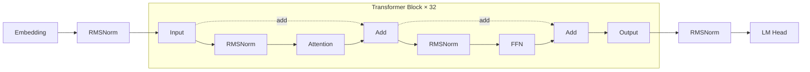
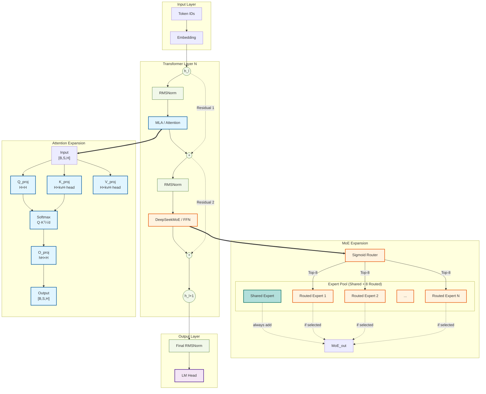

# LLM Architecture Generator

## Overview

A Claude Code skill that generates professional multi-level model architecture diagrams from HuggingFace models, local model files, or user-defined configurations. The output uses Mermaid syntax with two detail levels:

- **Level 1 (`-v`)**: Collapsed block view with left-right layout (graph LR), showing Attention/FFN/MoE/MLP modules grouped by layer count with dashed transformer block border
- **Level 2 (`-vv`)**: Expanded module internals with top-down layout (graph TD), showing detailed projections (Q/K/V/O, gate/up/down, router/experts) via `==>` expansion arrows

---

## Invocation Syntax

### Standard CLI Invocation

```
/llm-arch-generator <model> [-v|-vv] [--format png,svg,mmd] [--output /path/to/dir]
```

### Natural Language Invocation

When users describe what they want in natural language, interpret as follows:

| User says | Interpreted as |
|-----------|----------------|
| "Draw / generate / plot the architecture of {model}" | Standard generation with `-vv` (expanded) |
| "Simple / high-level / macro / collapsed view" | `-v` (collapsed) |
| "Detailed / expanded / with projections" | `-vv` (expanded) |
| "Save to {path}" | `--output /path` |
| "PNG / SVG / Mermaid format" | `--format` |

### Parameters

| Parameter | Description | Default |
|-----------|-------------|---------|
| `model` | HuggingFace model ID, local path to config.json, or YAML config | Required |
| `-v` | Level 1: collapsed block structure with residual connections (graph LR) | — |
| `-vv` | Level 2: expanded module internals via `==>` arrows (graph TD) | Default |
| `--format` | Output formats (comma-separated) | png,svg,mmd |
| `--output` | Output directory | Current working directory |

### Example Invocations

```bash
# Default (-vv): expanded view
/llm-arch-generator KimiML/kimi-k2-5

# Level 1 (-v): collapsed with residual connections
/llm-arch-generator meta-llama/Llama-3-8b -v

# Level 2 (-vv): explicit expanded view
/llm-arch-generator Qwen/Qwen2-7B -vv

# Natural language equivalents
/llm-arch-generator Draw a detailed architecture diagram for Kimi-K2.5
/llm-arch-generator Generate a simple macro view of LLaMA-3
/llm-arch-generator Plot the architecture of Qwen2-7B and save to ./qwen_arch

# With output format
/llm-arch-generator Qwen/Qwen2-7B --format png --output ./diagrams

# Local files
/llm-arch-generator /path/to/local/model --output ./diagrams
```

---

## Detail Levels

### `-v` (Level 1: Collapsed Block Structure)

Shows individual **Attention**, **FFN** (or **MoE**, **MLP**) modules visible in the flow, with a dashed box grouping them labeled `× N layers`. Residual connections are shown at this level using `-.->` arrows.

**Key characteristics:**
- Uses `graph LR` (left-right layout)
- Transformer blocks shown with `style TB dashed` border
- Attention and FFN/MoE modules visible inside (NOT hidden in black-box)
- Residual `add` operations shown explicitly

```
Embed ──► Norm ──► Input ──► RMSNorm ──► [Attention] ──► [FFN] ──► Output
                   │               │               │               │
                   └───────┬──────┴───────┬───────┘               │
                           │   add(pre)   │                       │
                           └──────────────┘                       │
                         ┌────────────────────────────────┐
                         │    Transformer Block × 32        │  ← dashed box
                         └────────────────────────────────┘
                                           │
                                     Norm ──► LM Head
```

### `-vv` (Level 2: Expanded Module Internals)

Top-down layout. Level 1 shows one transformer layer path (left/top). Complex modules (Attention, MoE/FFN) expand to detailed views (right/bottom) via `==>` arrows.

**Key characteristics:**
- Uses `graph TD` (top-down layout)
- Complex modules expanded via `==>` arrows (solid bold)
- Projection layers visible (Q_proj, K_proj, V_proj, O_proj, gate_proj, etc.)
- MoE shows Router + Expert Pool with shared/routed experts

---

## Information Extraction

### Shape Inference: config.json + model.py Combined

Shape inference **must combine** both sources — not config.json alone. The model.py contains full tensor definitions that enable precise shape calculation.

**From config.json:**
- `hidden_size` (H)
- `num_hidden_layers`
- `intermediate_size` (I)
- `num_attention_heads`
- `num_key_value_heads` (for GQA)
- `head_dim` = H / num_attention_heads

**From model.py:**

model.py contains **full tensor definitions** that enable precise shape calculation:

```python
# Example from modeling_llama.py
class LlamaAttention(nn.Module):
    def __init__(self, config):
        self.hidden_size = config.hidden_size
        self.num_heads = config.num_attention_heads
        self.head_dim = config.hidden_size // config.num_attention_heads

        # These are the actual tensor shapes defined in code:
        self.q_proj = nn.Linear(H, H)           # [H, H]
        self.k_proj = nn.Linear(H, kvH * head_dim)  # [H, kvH * head_dim]
        self.v_proj = nn.Linear(H, kvH * head_dim)  # [H, kvH * head_dim]
        self.o_proj = nn.Linear(H, H)            # [H, H]
```

**Correct shape annotations:**

| Layer | Shape |
|-------|-------|
| Q_proj weight | `[H, H]` or `[H, num_heads × head_dim]` |
| K_proj weight | `[H, num_key_value_heads × head_dim]` |
| V_proj weight | `[H, num_key_value_heads × head_dim]` |
| O_proj weight | `[H, num_heads × head_dim]` |
| Attention output (after softmax) | `[B, num_heads, S, head_dim]` |
| FFN gate/up | `[H, intermediate_size]` |
| FFN down | `[intermediate_size, H]` |

### Residual Connection Detection from model.py

Residual connections must be derived from **actual code analysis**, not assumptions. AI must read the actual `forward()` method and identify:
- Which tensor flows into which module
- Where `add` / `+` / `subtract` operations occur
- Which tensors are added together (residual source and destination)
- Conditional branches (training vs inference paths)

**Pre-norm pattern (LLaMA, Qwen, Kimi):**

```python
# Identified from model.py forward():
input = layer_norm(input)
output = attention(input)
input = input + output          # residual add here
output = mlp(input)
input = input + output          # residual add here
input = layer_norm(input)
```

**Post-norm pattern (GLM, some GPT variants):**

```python
# Identified from model.py forward():
output = attention(input)
input = norm(input + output)    # residual then norm
```

---

## Mermaid Syntax Generation

### Level 1: Block Structure with Residual Connections (graph LR)



**Key:** `subgraph TB` with `style TB dashed` shows the repeated modules with a dashed border. Attention and FFN are visible inside — NOT hidden in a black-box node.

### Level 2: Module Expansion (graph TD)

Level 1 structure (top-down), with complex modules (MoE, Attention) expanded on the right via `==>` relationship arrows.



---

## Color Conventions

Mermaid `classDef` style definitions used in diagrams:

```mermaid
classDef attention fill:#e1f5ff,stroke:#01579b,stroke-width:2px;
classDef moe fill:#fff3e0,stroke:#e65100,stroke-width:2px;
classDef shared_expert fill:#b2dfdb,stroke:#00695c,stroke-width:2px;
classDef ffn fill:#fff4e1,stroke:#333,stroke-width:2px;
classDef norm fill:#f1f8e9,stroke:#33691e,stroke-width:1px;
classDef input_stage fill:#f3e5f5,stroke:#4a148c,stroke-width:2px;
classDef output_stage fill:#f3e5f5,stroke:#4a148c,stroke-width:2px;
```

| Module Type | Fill | Border | Usage |
|-------------|------|--------|-------|
| Attention | #e1f5ff | #01579b | MLA, Q/K/V/O projections, Softmax |
| MoE | #fff3e0 | #e65100 | Router, Routed Experts |
| Shared Expert | #b2dfdb | #00695c | Shared Expert (always active) |
| FFN / MLP | #fff4e1 | #333 | gate/up/down_proj |
| Norm | #f1f8e9 | #33691e | RMSNorm, LayerNorm |
| Input/Output | #f3e5f5 | #4a148c | Embedding, LM Head |
| Residual | dashed | #999 | `-.->` arrows |
| Expand relation | solid bold | — | `==>` arrows (Level 1 to Level 2) |

---

## Components

### AI-Generated Components (SKILL.md instructs AI)

| Component | Responsibility |
|-----------|----------------|
| **Parser** | AI reads config.json, extracts H, I, num_heads, kv_heads, layers |
| **Model Analyzer** | AI reads model.py, builds module tree, traces forward path |
| **Residual Detector** | AI reads forward() method, identifies add/shortcut operations |
| **Shape Calculator** | AI computes shapes from model.py weight definitions × config.json params |
| **Mermaid Generator** | AI generates left-right syntax per detail level |
| **Auto-completion** | AI fills missing info based on model family conventions |

### Script-Tool Components

| Component | File | Language | Purpose |
|-----------|------|----------|---------|
| **Downloader** | `scripts/download_model.py` | Python | Download config.json + model.py from HuggingFace |
| **Renderer** | `scripts/render_mermaid.sh` | Bash | Render .mmd to PNG/SVG via mermaid-cli |

### download_model.py

Use `scripts/download_model.py` to download model files from HuggingFace:

```bash
python scripts/download_model.py <model_id> [--output-dir DIR] [--no-cache]
```

This script:
- Uses `list_repo_files()` to scan the entire repository for modeling files
- Downloads `config.json` and found `modeling_*.py` files
- Caches to `~/.cache/llm_arch_generator/{model_id}/`
- Returns tuple of `(config_path, model_path)`

---

## Input Handling

### 1. HuggingFace Model ID Parsing

When a HuggingFace model ID is provided (e.g., `meta-llama/Llama-3-8b`):

1. Download `config.json` from HuggingFace Hub using the model ID (via `scripts/download_model.py`)
2. Cache the config to `~/.cache/llm_arch_generator/{model_id}/`
3. Parse the config.json to extract model parameters
4. Download model.py using `list_repo_files()` to scan the entire repository
5. Match against known model family templates

**Extracted parameters from config.json:**
- `hidden_size`
- `num_hidden_layers`
- `intermediate_size`
- `num_attention_heads`
- `num_key_value_heads` (for GQA)
- `vocab_size`
- `activation_function`
- `rms_norm_eps`
- `rope_theta`

### 2. Local File Path Handling

When a local path is provided:
1. If path points to a directory, read `config.json` from that directory
2. If path points to a `.yaml` file, treat as YAML config (see below)
3. Parse and extract model parameters

### 3. YAML Config Direct Input

When a YAML config is provided directly, use it as-is for diagram generation.

**Full Specification Example:**

```yaml
model_name: my-custom-model

blocks:
  - name: encoder
    type: transformer_block
    layers: 12
    hidden_size: 768
    intermediate_size: 3072
    num_attention_heads: 12

  - name: decoder
    type: transformer_block
    layers: 12
    hidden_size: 768

connections:
  - from: encoder
    to: decoder

norm: rmsnorm
activation: silu
```

**Minimal Specification (AI fills defaults):**

```yaml
model_name: my-custom-model
hidden_size: 768
num_layers: 24
intermediate_size: 3072
num_attention_heads: 12
num_key_value_heads: 32
activation: silu
norm: rmsnorm
```

---

## Template Matching

### Supported Model Families

The skill matches against these model family templates:

| Family | Template Path | Key Characteristics |
|--------|---------------|---------------------|
| LLaMA | `templates/llama/common.yaml` | RMSNorm, SiLU, pre-norm |
| Mistral | `templates/mistral/common.yaml` | LLaMA derivative, GQA support |
| Qwen | `templates/qwen/common.yaml` | LLaMA derivative, SiLU |
| GLM | `templates/glm/common.yaml` | Post-norm residual |
| Baichuan | `templates/baichuan/common.yaml` | LLaMA derivative |
| Mimo | `templates/mimo/common.yaml` | Standard transformer |
| Kimi | `templates/kimi/common.yaml` | MoE or standard transformer |
| MiniMax | `templates/minimax/common.yaml` | Standard transformer |
| GPT-OSS | `templates/gpt-oss/common.yaml` | GELU activation, post-norm |

### Template Format

```yaml
model_type: llama
family: llama

block:
  - type: attention
    components:
      - q_proj
      - k_proj
      - v_proj
      - o_proj
  - type: ffn
    components:
      - gate_proj
      - up_proj
      - down_proj

stack:
  num_layers_key: num_hidden_layers
  pattern: [block] × N

residual: pre-norm
norm: rmsnorm
activation: silu
input: embed_tokens
output: lm_head
kv_heads_key: num_key_value_heads  # Optional, for GQA
```

### Matching Algorithm

1. Extract `model_type` from config.json or YAML
2. Match against known model families (llama, mistral, qwen, glm, etc.)
3. If no exact match, use closest family based on:
   - `model_type` field
   - `architectures` field (e.g., "LlamaForCausalLM")
   - Block structure (attention + FFN pattern)

---

## AI Auto-Completion Rules

When config.json provides partial information, AI auto-fills missing details based on model type conventions:

| Information | Source | Fallback |
|-------------|--------|----------|
| hidden_size | config.json direct read | Required |
| num_layers | config.json direct read | Required |
| intermediate_size | config.json direct read | 4 × hidden_size |
| num_attention_heads | config.json or calculation | hidden_size / head_dim |
| num_key_value_heads | config.json | num_attention_heads (no GQA) |
| Norm type | Model type knowledge | RMSNorm |
| Activation function | config.json or model type | SiLU for LLaMA, GELU for GPT |
| Residual connection type | Model type knowledge (from forward() analysis) | pre-norm |
| Module connections | Model type knowledge | Standard transformer flow |

### Default Norm Types by Family

- **LLaMA, Mistral, Qwen, Baichuan:** RMSNorm
- **GLM:** LayerNorm (post-norm pattern)
- **GPT-OSS:** LayerNorm

### Default Activation by Family

- **LLaMA, Mistral, Qwen, Baichuan:** SiLU
- **GPT-OSS:** GELU

### Residual Connection Patterns

- **pre-norm:** `Norm → Attention → FFN → residual add`
- **post-norm:** `Attention → FFN → residual add → Norm`

---

## Shape Calculation Rules

### Attention Weights

```
q_proj: [hidden_size, hidden_size]       # or [hidden_size, num_attention_heads × head_dim]
k_proj: [hidden_size, num_key_value_heads × head_dim]
v_proj: [hidden_size, num_key_value_heads × head_dim]
o_proj: [num_attention_heads × head_dim, hidden_size]
```

### FFN Weights

```
gate_proj: [hidden_size, intermediate_size]
up_proj:   [hidden_size, intermediate_size]
down_proj: [intermediate_size, hidden_size]
```

### Shape Display Format

```
Attention:   input_hidden → output_hidden [h=num_attention_heads kv=num_kv_heads]
FFN:         input_hidden → intermediate → output_hidden
Embedding:   vocab_size → hidden_size
Output Head: hidden_size → vocab_size
```

### GQA (Grouped Query Attention) Handling

- If `num_key_value_heads < num_attention_heads`: Render with separate kv_heads count
- If `num_key_value_heads == num_attention_heads`: Omit kv display (standard MHA)

---

## Workflow

```
1. User invokes /llm-arch-generator <model> [options]
            │
            ▼
2. Parse invocation (standard CLI or natural language)
            │
            ▼
3. (If HuggingFace) Script: download_model.py
   - config.json → parse H, I, num_heads, kv_heads, layers
   - model.py → scan repo with list_repo_files() to locate, then download
            │
            ▼
4. AI: Read model.py
   - Build module tree (Attention, FFN/MoE/MLP, projections)
   - Trace forward() path and residual connections
            │
            ▼
5. AI: Calculate shapes
   - Weight shapes from model.py (Linear layers)
   - Activation shapes from config.json (H, I, head_dim)
   - Propagation: [B, S, H] through each op
            │
            ▼
6. AI: Generate Mermaid syntax
   - Level 1 (-v): graph LR with dashed transformer block
   - Level 2 (-vv): graph TD with expanded projections
   - Respects -v/-vv detail level
            │
            ▼
7. Write {model_name}_arch.mmd
            │
            ▼
8. (If --format includes png/svg) Script: render_mermaid.sh → PNG/SVG
            │
            ▼
9. Output files to {output_dir}/
```

### Fallback Path

If model.py is not available (only weight files):
- AI infers structure from config.json + model family template
- Shape calculations use family conventions (H, I, head_dim relationships)
- Residual patterns use family defaults (pre-norm for LLaMA, post-norm for GLM)
- Note: precision reduced, model.py analysis preferred

---

## Output Files

```
{output_dir}/
├── {model_name}_arch.png    # Rendered raster image
├── {model_name}_arch.svg    # Rendered vector image
└── {model_name}_arch.mmd    # Mermaid source (always generated)
```

- `model_name`: Sanitized model name (slashes replaced with `-`)
- Default output directory: Current working directory
- User-specified via `--output /path/to/dir`

---

## Mermaid CLI Rendering

### Prerequisites

- Node.js installed
- `@mermaid-js/mermaid-cli` installed (via npm or npx)

### Installation (Linux/macOS)

```bash
# Global install
npm install -g @mermaid-js/mermaid-cli

# Or use via npx
npx @mermaid-js/mermaid-cli mmdc --version
```

### Installation (Windows)

1. Install Node.js from [https://nodejs.org/](https://nodejs.org/) (LTS version recommended)
2. Open PowerShell and install mermaid-cli:

```powershell
# Global install
npm install -g @mermaid-js/mermaid-cli

# Verify installation
npx @mermaid-js/mermaid-cli mmdc --version
```

### Windows Usage with PowerShell

The helper script `scripts/render_mermaid.ps1` provides PowerShell-compatible rendering:

```powershell
# Navigate to the script directory
cd scripts

# Render PNG
.\render_mermaid.ps1 -Input "diagram.mmd" -OutputPng "diagram.png"

# Render PNG and SVG
.\render_mermaid.ps1 -Input "diagram.mmd" -OutputPng "diagram.png" -OutputSvg "diagram.svg"
```

**Note:** On Windows, use backslashes in paths or PowerShell will interpret them correctly with tab completion.

### Rendering Options

| Option | Description | Default |
|--------|-------------|---------|
| `-i` | Input file | Required |
| `-o` | Output file | Required |
| `-b` | Background | transparent |
| `-w` | Width (pixels) | 1920 |

---

## File Structure

```
llm-arch-generator/
├── SKILL.md                         # AI instructions (main entry)
├── docs/superpowers/
│   └── specs/
│       └── 2026-03-26-llm_arch_generator-design.md
├── scripts/
│   ├── download_model.py            # HuggingFace file downloader (with repo scanning)
│   ├── render_mermaid.sh            # Mermaid CLI renderer (Linux/macOS)
│   └── render_mermaid.ps1          # Mermaid CLI renderer (Windows)
└── templates/                       # Model family templates
    ├── llama/common.yaml
    ├── mistral/common.yaml
    ├── qwen/common.yaml
    ├── glm/common.yaml
    ├── baichuan/common.yaml
    ├── mimo/common.yaml
    ├── kimi/common.yaml
    ├── minimax/common.yaml
    └── gpt-oss/common.yaml
```

---

## Summary: AI vs Script Responsibilities

| Task | Responsibility |
|------|----------------|
| Parse config.json | **AI** |
| Locate model.py in repo (scan with list_repo_files) | **Script** |
| Read model.py | **AI** (directly reads file) |
| Analyze module hierarchy | **AI** |
| Trace forward path | **AI** |
| Detect residual connections | **AI** (from model.py forward() analysis) |
| Calculate tensor shapes | **AI** (from model.py weight definitions × config.json params) |
| Generate Mermaid syntax | **AI** |
| Interpret natural language | **AI** |
| Download HuggingFace files | **Script** (Python) |
| Render PNG/SVG | **Script** (Bash + mermaid-cli) |
| Auto-fill missing parameters | **AI** (from model family knowledge) |
