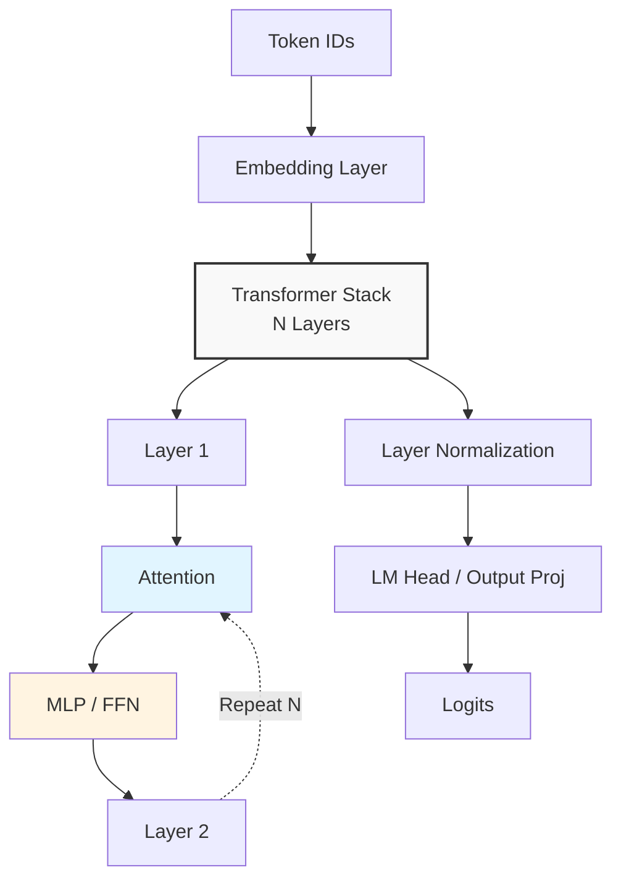
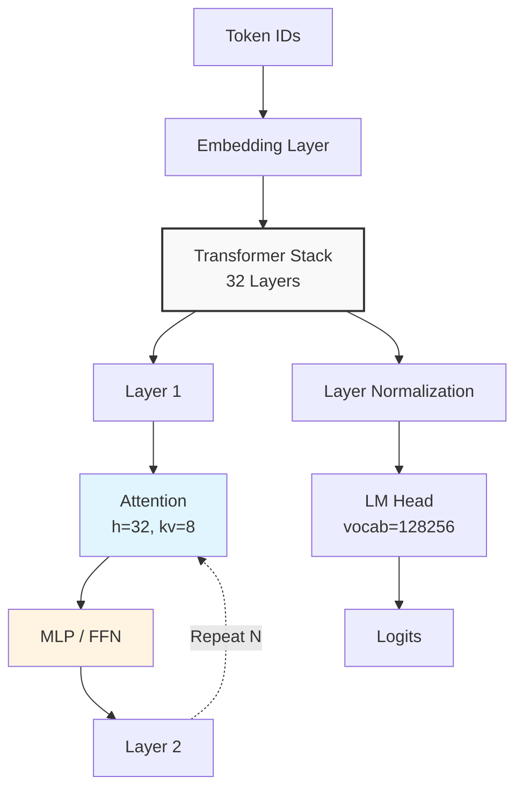

# LLM Architecture Generator

## Overview

A Claude Code skill that generates professional model architecture diagrams from open-source models or user-defined configurations. Supports multiple output formats (PNG/SVG/Mermaid) for use in documentation, papers, and presentations.

## Invocation Syntax

```
/llm-arch-generator <model> [--format png,svg,mmd] [--output /path/to/dir]
```

### Parameters

| Parameter | Description | Default |
|-----------|-------------|---------|
| `model` | HuggingFace model ID, local path to config.json, or YAML config | Required |
| `--format` | Output formats (comma-separated) | png,svg,mmd |
| `--output` | Output directory | Current working directory |

### Example Invocations

```bash
# Generate diagram from HuggingFace model
/llm-arch-generator meta-llama/Llama-3-8b

# Generate PNG and SVG from local model
/llm-arch-generator /path/to/local/model --format png,svg

# Generate from YAML config with custom output
/llm-arch-generator /path/to/model.yaml --output ./diagrams
```

---

## Input Handling

### 1. HuggingFace Model ID Parsing

When a HuggingFace model ID is provided (e.g., `meta-llama/Llama-3-8b`):

1. Download `config.json` from HuggingFace Hub using the model ID
2. Cache the config to `templates/{family}/{model_name}.yaml`
3. Parse the config.json to extract model parameters
4. Match against known model family templates

**Extracted parameters from config.json:**
- `hidden_size`
- `num_hidden_layers`
- `intermediate_size`
- `num_attention_heads`
- `num_key_value_heads` (for GQA)
- `vocab_size`
- `activation_function`
- `rms_norm_eps`
- `rope_theta`

### 2. Local File Path Handling

When a local path is provided:
1. If path points to a directory, read `config.json` from that directory
2. If path points to a `.yaml` file, treat as YAML config (see below)
3. Parse and extract model parameters

### 3. YAML Config Direct Input

When a YAML config is provided directly, use it as-is for diagram generation.

**Full Specification Example:**

```yaml
model_name: my-custom-model

blocks:
  - name: encoder
    type: transformer_block
    layers: 12
    hidden_size: 768
    intermediate_size: 3072
    num_attention_heads: 12

  - name: decoder
    type: transformer_block
    layers: 12
    hidden_size: 768

connections:
  - from: encoder
    to: decoder

norm: rmsnorm
activation: silu
```

**Minimal Specification (AI fills defaults):**

```yaml
model_name: my-custom-model
hidden_size: 768
num_layers: 24
intermediate_size: 3072
num_attention_heads: 12
num_key_value_heads: 32
activation: silu
norm: rmsnorm
```

---

## Template Matching Logic

### Supported Model Families

The skill matches against these model family templates:

| Family | Template Path | Key Characteristics |
|--------|---------------|---------------------|
| LLaMA | `templates/llama/common.yaml` | RMSNorm, SiLU, pre-norm |
| Mistral | `templates/mistral/common.yaml` | LLaMA derivative, GQA support |
| Qwen | `templates/qwen/common.yaml` | LLaMA derivative, SiLU |
| GLM | `templates/glm/common.yaml` | Post-norm residual |
| Baichuan | `templates/baichuan/common.yaml` | LLaMA derivative |
| Mimo | `templates/mimo/common.yaml` | Standard transformer |
| Kimi | `templates/kimi/common.yaml` | MoE or standard transformer |
| MiniMax | `templates/minimax/common.yaml` | Standard transformer |
| GPT-OSS | `templates/gpt-oss/common.yaml` | GELU activation, post-norm |

### Template Format

```yaml
model_type: llama
family: llama

block:
  - type: attention
    components:
      - q_proj
      - k_proj
      - v_proj
      - o_proj
  - type: ffn
    components:
      - gate_proj
      - up_proj
      - down_proj

stack:
  num_layers_key: num_hidden_layers
  pattern: [block] × N

residual: pre-norm
norm: rmsnorm
activation: silu
input: embed_tokens
output: lm_head
kv_heads_key: num_key_value_heads  # Optional, for GQA
```

### Matching Algorithm

1. Extract `model_type` from config.json or YAML
2. Match against known model families (llama, mistral, qwen, glm, etc.)
3. If no exact match, use closest family based on:
   - `model_type` field
   - `architectures` field (e.g., "LlamaForCausalLM")
   - Block structure (attention + FFN pattern)

---

## AI Auto-Completion Rules

When config.json provides partial information, AI auto-fills missing details based on model type conventions:

| Information | Source | Fallback |
|-------------|--------|----------|
| hidden_size | config.json direct read | Required |
| num_layers | config.json direct read | Required |
| intermediate_size | config.json direct read | 4 × hidden_size |
| num_attention_heads | config.json or calculation | hidden_size / head_dim |
| num_key_value_heads | config.json | num_attention_heads (no GQA) |
| Norm type | Model type knowledge | RMSNorm |
| Activation function | config.json or model type | SiLU for LLaMA, GELU for GPT |
| Residual connection type | Model type knowledge | pre-norm |
| Module connections | Model type knowledge | Standard transformer flow |

### Default Norm Types by Family

- **LLaMA, Mistral, Qwen, Baichuan:** RMSNorm
- **GLM:** LayerNorm (post-norm pattern)
- **GPT-OSS:** LayerNorm

### Default Activation by Family

- **LLaMA, Mistral, Qwen, Baichuan:** SiLU
- **GPT-OSS:** GELU

### Residual Connection Patterns

- **pre-norm:** `Norm → Attention → FFN → residual add`
- **post-norm:** `Attention → FFN → residual add → Norm`

---

## Shape Calculation Rules

### Attention Weights

```
q_proj: [hidden_size, hidden_size]       # or [hidden_size, num_attention_heads × head_dim]
k_proj: [hidden_size, num_key_value_heads × head_dim]
v_proj: [hidden_size, num_key_value_heads × head_dim]
o_proj: [num_attention_heads × head_dim, hidden_size]
```

### FFN Weights

```
gate_proj: [hidden_size, intermediate_size]
up_proj:   [hidden_size, intermediate_size]
down_proj: [intermediate_size, hidden_size]
```

### Shape Display Format

```
Attention:   input_hidden → output_hidden [h=num_attention_heads kv=num_kv_heads]
FFN:         input_hidden → intermediate → output_hidden
Embedding:   vocab_size → hidden_size
Output Head: hidden_size → vocab_size
```

### GQA (Grouped Query Attention) Handling

- If `num_key_value_heads < num_attention_heads`: Render with separate kv_heads count
- If `num_key_value_heads == num_attention_heads`: Omit kv display (standard MHA)

---

## Mermaid Syntax Generation

### Key Formatting Rules

1. Use `graph TB` for top-to-bottom layout
2. Keep labels simple: `Attention`, `MLP / FFN`, `Layer Normalization`
3. Show layer count in Transformer Stack: `Transformer Stack<br/>N Layers`
4. Use `-.->|Repeat N|` to indicate layer repetition
5. Apply distinct styling to distinguish module types
6. For GQA: show `h=num_attention_heads, kv=num_key_value_heads` in Attention label
7. Optional: expand specific layer internals when users request detail

### Reference Example: 2-Layer LLaMA-style Model



### Example: LLaMA-3-8B with GQA

For LLaMA-3-8B where `num_attention_heads=32` and `num_key_value_heads=8`:



### Subgraph Style Conventions

| Element | Fill Color | Border |
|---------|-------------|--------|
| Transformer Stack | #f9f9f9 (light gray) | #333 |
| Attention | #e1f5ff (light blue) | #333 |
| MLP / FFN | #fff4e1 (light orange) | #333 |
| Layer Normalization | #f5f5f5 (very light gray) | #333 |

### Layer Detail (Optional Expanded View)

When users want to see layer internals:

```mermaid
subgraph Block_N[Layer N]
    direction TB
    Norm[LayerNorm / RMSNorm] --> Attention
    Attention --> Residual[Residual Connection]
    Residual --> MLP[MLP / FFN]
    MLP --> Residual
end
```

---

## Output File Naming Convention

```
{output_dir}/
├── {model_name}_arch.png    # Raster image
├── {model_name}_arch.svg    # Vector image
└── {model_name}_arch.mmd    # Mermaid source
```

- `model_name`: Sanitized model name (slashes replaced with `-`)
- Default output directory: Current working directory
- User-specified via `--output /path/to/dir`

---

## Mermaid CLI Rendering Instructions

### Prerequisites

- Node.js installed
- `@mermaid-js/mermaid-cli` installed (via npm or npx)

### Installation (Linux/macOS)

```bash
# Global install
npm install -g @mermaid-js/mermaid-cli

# Or use via npx
npx @mermaid-js/mermaid-cli mmdc --version
```

### Installation (Windows)

1. Install Node.js from [https://nodejs.org/](https://nodejs.org/) (LTS version recommended)
2. Open PowerShell and install mermaid-cli:

```powershell
# Global install
npm install -g @mermaid-js/mermaid-cli

# Verify installation
npx @mermaid-js/mermaid-cli mmdc --version
```

### Windows Usage with PowerShell

The helper script `scripts/render_mermaid.ps1` provides PowerShell-compatible rendering:

```powershell
# Navigate to the script directory
cd scripts

# Render PNG
.\render_mermaid.ps1 -Input "diagram.mmd" -OutputPng "diagram.png"

# Render PNG and SVG
.\render_mermaid.ps1 -Input "diagram.mmd" -OutputPng "diagram.png" -OutputSvg "diagram.svg"
```

**Note:** On Windows, use backslashes in paths or PowerShell will interpret them correctly with tab completion.

### Rendering Commands

```bash
# Render PNG (default)
/llm-arch-generator meta-llama/Llama-3-8b --format png

# Render PNG and SVG
/llm-arch-generator meta-llama/Llama-3-8b --format png,svg

# Output to specific directory
/llm-arch-generator meta-llama/Llama-3-8b --output ./diagrams
```

### Manual Rendering (if needed)

```bash
# Using mermaid-cli directly
mmdc -i model_diagram.mmd -o model_diagram.png -b transparent -w 1920
mmdc -i model_diagram.mmd -o model_diagram.svg -b transparent -w 1920 -f svg
```

### Rendering Options

| Option | Description | Default |
|--------|-------------|---------|
| `-i` | Input file | Required |
| `-o` | Output file | Required |
| `-b` | Background | transparent |
| `-w` | Width (pixels) | 1920 |

---

## File Structure

```
create_model_arch_diagram/
├── SKILL.md                     # This file - Skill main entry
├── docs/
│   └── superpowers/
│       ├── specs/
│       │   └── 2026-03-21-create_model_arch_diagram-design.md
│       └── plans/
│           └── 2026-03-21-create_model_arch_diagram-implementation-plan.md
├── templates/                    # Model structure templates
│   ├── llama/
│   ├── mistral/
│   ├── qwen/
│   ├── glm/
│   ├── baichuan/
│   ├── mimo/
│   ├── kimi/
│   ├── minimax/
│   └── gpt-oss/
└── scripts/
    ├── render_mermaid.sh        # Bash helper script for CLI rendering (Linux/macOS)
    └── render_mermaid.ps1      # PowerShell helper script for CLI rendering (Windows)
```

---

## Complete Workflow

```
1. User invokes: /llm-arch-generator <model> [--format ...] [--output ...]
2. Parse input:
   - HuggingFace ID: Download config.json
   - Local path: Read config.json or YAML
   - YAML config: Use directly
3. Match against model family template
4. Auto-fill missing parameters using AI knowledge
5. Calculate shapes and generate Mermaid syntax
6. Create Mermaid source file (.mmd)
7. Render to PNG/SVG if requested (via mermaid-cli)
8. Output files to specified directory
```

---

## Example Complete Invocations

```bash
# Basic usage with HuggingFace model
/llm-arch-generator meta-llama/Llama-3-8b

# Multi-format output
/llm-arch-generator mistralai/Mistral-7B-v0.3 --format png,svg,mmd

# Local model with custom output
/llm-arch-generator /home/user/models/my-llama --output ./output

# Custom YAML config
/llm-arch-generator /path/to/model.yaml --format png
```
