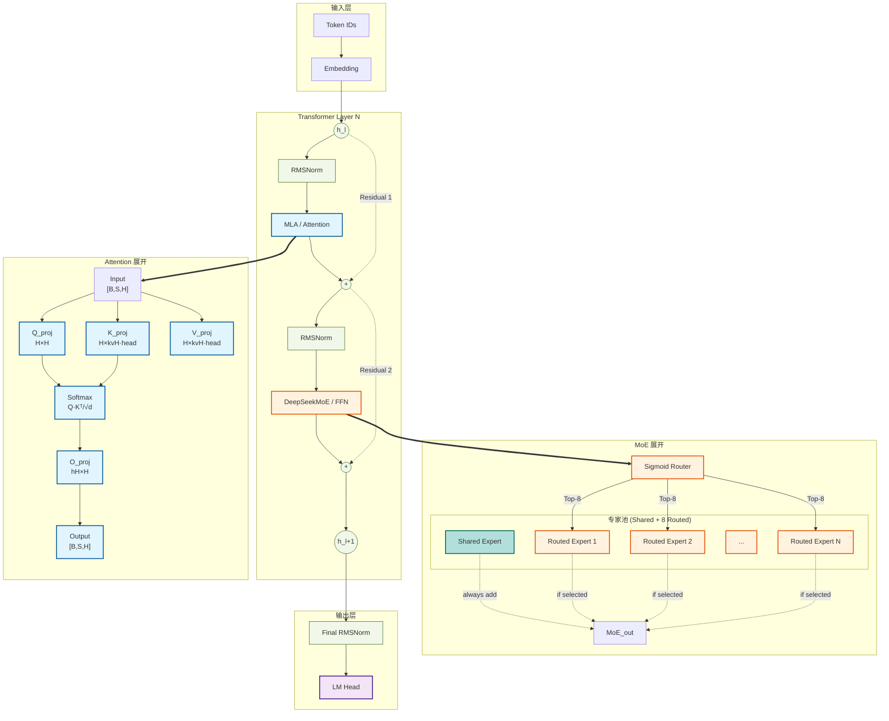

# LLM Architecture Generator

## Invocation

```
/llm-arch-generator <model> [-v|-vv] [--format png,svg,mmd] [--output /path/to/dir]
```

**IMPORTANT: This skill ALWAYS uses `-vv` (expanded view) by default.** The expanded view shows detailed internal structure including projection layers, router mechanisms, and expert pools. Do NOT use `-v` unless the user explicitly requests a simple/collapsed view.

**Natural language mapping:**

| User says | Interpreted as |
|-----------|---------------|
| "Draw/plot/generate architecture of {model}" | `-vv` (expanded, detailed) |
| "Simple/high-level/macro/collapsed view" | `-v` (collapsed) — only if explicitly requested |
| "Detailed/expanded/with projections" | `-vv` (expanded, detailed) |
| "Save to {path}" | `--output /path` |

**Parameters:**

| Parameter | Description | Default |
|-----------|-------------|---------|
| `model` | HuggingFace ID, local path, or YAML config | Required |
| `-vv` | Level 2: **EXPANDED** detailed view with all internals | **ALWAYS DEFAULT** |
| `-v` | Level 1: collapsed blocks (only if user explicitly asks) | — |
| `--format` | Output formats | png,svg,mmd |
| `--output` | Output directory | CWD |

### Examples

```bash
# ALWAYS expanded detailed view by default
/llm-arch-generator moonshotai/Kimi-K2.5

# Expanded view for DeepSeek V3 (MoE architecture)
/llm-arch-generator deepseek-ai/DeepSeek-V3-Base -vv

# Only use collapsed view if explicitly requested
/llm-arch-generator gpt2 -v

# With PNG output
/llm-arch-generator Qwen/Qwen2-7B --format png --output ./diagrams

# Natural language
/llm-arch-generator Draw the architecture of LLaMA-3 and show me the projections
```

---

## Workflow

### Step 1: Resolve Model ID
If user provides a model name (e.g., "Kimi-K2.5", "LLaMA-3", "DeepSeek V3"), search for the HuggingFace model ID first:
- Use web search to find the official HuggingFace repository
- Common patterns: `moonshotai/Kimi-K2.5`, `meta-llama/Llama-3-8b`, `deepseek-ai/DeepSeek-V3`, `Qwen/Qwen2-7B`
- If multiple matches exist, use the official/original model

### Step 2: Download Model Files
Once resolved, download via `scripts/download_model.py`:
```bash
python scripts/download_model.py <model_id>
```
- Scans repo with `list_repo_files()` to find ALL `modeling_*.py` files
- Caches to `~/.cache/llm_arch_generator/{model_id}/`
- **Select the correct modeling file**: Read `config.json` → get `auto_map["AutoModel"]` (e.g., `"modeling_kimi_k25.KimiK25ForConditionalGeneration"`). Extract the file prefix before the `.` (e.g., `modeling_kimi_k25`). Pick the `modeling_*.py` whose filename contains this prefix (case-insensitive). If none match, fall back to the first file.

### Step 3: Analyze Model Structure
Read model.py to build the module tree and trace the forward() path:
- Identify all major modules (attention, FFN, MoE, router, norms)
- Detect residual connections from actual code analysis (look for `residual = hidden_states`, `hidden_states + residual`, `hidden_states = hidden_states + other`)
- Calculate tensor shapes from config.json + weight definitions

### Step 4: Generate Mermaid Diagram (Level 2 Expanded)
**ALWAYS generate expanded view (`graph TD`) with maximum detail.** The diagram must show:

**Required elements for expanded view:**
1. **Embedding layer** with vocab size and hidden dimension
2. **Input RMSNorm** (if present before first layer)
3. **Attention internals**: Q/K/V projections, rotary embedding (RoPE), softmax, O projection
4. **MLP/FFN internals**: gate_proj, up_proj, down_proj (or DeepseekV3MLP structure)
5. **MoE internals**: Router (with activation function and top-K), Shared Expert, Routed Expert Pool
6. **All residual connections** shown as dashed `-.->` arrows with labels
7. **Final RMSNorm and LM Head**
8. **For multimodal models**: Vision encoder, Projector

**Graph structure rules:**
- Use `graph TD` (top-down) layout
- Use `==>` for expansion arrows (show "internals" of a module)
- Use `-.->` for residual connections (dashed arrows)
- Use `subgraph` with `direction TB` for module groupings
- Apply color classes from the Color Conventions section

### Step 5: Verify Mermaid Syntax
**CRITICAL: After generating the Mermaid diagram, you MUST verify syntax.** Common issues:

1. **Check for balanced statements**: Every node definition (`A["text"]`) should have proper connections
2. **Check for duplicate node IDs**: Each node ID must be unique within the diagram
3. **Check subgraph naming**: Subgraph IDs must be unique, labels must be quoted if they contain special chars
4. **Check arrow syntax**: `-->` for normal, `==>` for expansion, `-.->` for residual
5. **Check classDef/class assignments**: Ensure all class names in `class X className` are defined in classDef

**Verification command:**
```bash
# Try to render with mermaid CLI to catch syntax errors
bash scripts/render_mermaid.sh <output_file>.mmd 2>&1
# If rendering fails, examine the error:
# - "Parse error" = syntax issue in .mmd file
# - "Chrome not found" = rendering issue, but syntax may be OK (file is still usable)
```

**If syntax errors found, fix them:**
- Missing quotes on subgraph labels with special chars → add quotes
- Duplicate node IDs → rename with unique suffixes (_1, _2, etc.)
- Undefined class references → add classDef or remove class reference
- Invalid arrow syntax → use correct arrow type

### Step 6: Render Output
Generate PNG/SVG via `scripts/render_mermaid.sh`:
```bash
bash scripts/render_mermaid.sh {model_name}_arch.mmd
```

**Fallback handling:**
- Model name not recognized → Search web for HuggingFace ID, ask user to confirm if ambiguous
- HuggingFace download fails → Use cached files if available, or try alternative approach
- `modeling_*.py` not found → Still generate diagram from config.json + template, note precision reduced
- Rendering fails (missing Chrome) → Still generate `.mmd` file, user can render manually via [Mermaid Live Editor](https://mermaid.live/edit)

---

## Expanded View Details

### Level 2 (-vv): Maximum Detail

This is the **ALWAYS DEFAULT** view. It shows the complete internal structure:



### Attention Expansion (for MLA/Standard Attention)

Show Q/K/V/O projections separately, along with RoPE:
```
Input --> Q_proj["Q_proj<br/>H → num_heads×head_dim"]
Input --> KV_proj["KV_proj<br/>H → kv_rank + rope_dim"]
Q_proj --> RoPE["RoPE (YaRN/DynamicNTK)"]
KV_proj --> K_RMSNorm["K_RMSNorm"]
K_RMSNorm --> RoPE
RoPE --> Softmax["Softmax(Q·Kᵀ/√d)"]
KV_proj --> Softmax
Softmax --> O_proj["O_proj<br/>num_heads×v_dim → H"]
```

### MoE Expansion (DeepSeek V3 Style)

Show router, shared expert, and routed expert pool:
```
MoE --> Router["MoEGate<br/>sigmoid routing"]
MoE --> Shared["Shared Expert<br/>MLP(2048)"]:::shared_expert
Router -->|"top-8"| Expert1["Expert 1"]:::moe
Router -->|"top-8"| Expert2["Expert 2"]:::moe
Router -->|"top-8"| ExpertN["..."]
Router -->|"top-8"| Expert384["Expert 384"]:::moe
Shared -.->|"always add"| MoE_Out
Expert1 -.->|"if selected"| MoE_Out
Expert2 -.->|"if selected"| MoE_Out
Expert384 -.->|"if selected"| MoE_Out
```

---

## Color Conventions

```mermaid
classDef attention fill:#e1f5ff,stroke:#01579b,stroke-width:2px
classDef moe fill:#fff3e0,stroke:#e65100,stroke-width:2px
classDef shared_expert fill:#b2dfdb,stroke:#00695c,stroke-width:2px
classDef ffn fill:#fff4e1,stroke:#333,stroke-width:2px
classDef norm fill:#f1f8e9,stroke:#33691e,stroke-width:1px
classDef vision fill:#e8f5e9,stroke:#2e7d32,stroke-width:2px
classDef projector fill:#fce4ec,stroke:#c2185b,stroke-width:2px
classDef input_stage fill:#f3e5f5,stroke:#4a148c,stroke-width:2px
classDef output_stage fill:#f3e5f5,stroke:#4a148c,stroke-width:2px
```

| Module | Fill | Border |
|--------|------|--------|
| Attention | #e1f5ff | #01579b |
| MoE | #fff3e0 | #e65100 |
| Shared Expert | #b2dfdb | #00695c |
| FFN/MLP | #fff4e1 | #333 |
| Norm | #f1f8e9 | #33691e |
| Vision Tower | #e8f5e9 | #2e7d32 |
| Projector | #fce4ec | #c2185b |
| Input/Output | #f3e5f5 | #4a148c |
| Residual | dashed | #999 |
| Expand `==>` | solid bold | — |

---

## Output Files

```
{output_dir}/
├── {model_name}_arch.png   (if Chrome available)
├── {model_name}_arch.svg   (if Chrome available)
└── {model_name}_arch.mmd   (always generated, syntax-verified)
```

---

## Reference

**Full details** (including complete mermaid syntax examples, shape inference methodology, residual detection patterns, and model family conventions): `docs/superpowers/specs/2026-03-26-llm_arch_generator-design.md`

**When to read the spec:**
- Need complete mermaid diagram examples → read spec lines 185-307
- Implementing shape inference → read spec lines 92-153
- Understanding residual patterns → read spec lines 155-181
- Template matching → read spec lines 449-506
