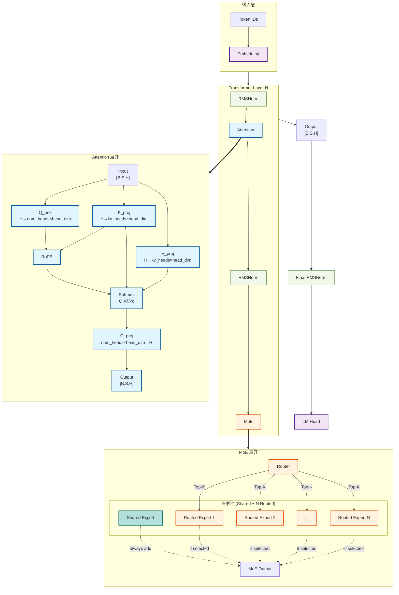

# LLM 架构生成器

## 调用方式

```
/llm-arch-generator <model> [-v|-vv] [--format png,svg,mmd] [--output /path/to/dir]
```

**重要：此 skill 默认始终使用 `-vv`（扩展视图）。** 扩展视图展示详细内部结构，包括投影层、路由机制和专家池。除非用户明确要求，否则不要使用 `-v`。

**自然语言映射：**

| 用户说法 | 解析为 |
|---------|--------|
| "绘制/展示/生成 {model} 的架构" | `-vv`（扩展、详细） |
| "简单/高层/宏观/折叠视图" | `-v`（折叠）— 仅当明确要求时 |
| "详细/扩展/带投影" | `-vv`（扩展、详细） |
| "保存到 {路径}" | `--output /path` |

**参数：**

| 参数 | 描述 | 默认值 |
|------|------|--------|
| `model` | HuggingFace ID、本地路径或 YAML 配置 | 必填 |
| `-vv` | Level 2：**EXPANDED** 详细视图，包含所有内部结构 | **始终默认** |
| `-v` | Level 1：折叠块（仅当用户明确要求时使用） | — |
| `--format` | 输出格式 | png,svg,mmd |
| `--output` | 输出目录 | CWD |

### 示例

```bash
# 默认始终生成扩展详细视图
/llm-arch-generator moonshotai/Kimi-K2.5

# DeepSeek V3（MoE 架构）的扩展视图
/llm-arch-generator deepseek-ai/DeepSeek-V3-Base -vv

# 仅当明确要求时才使用折叠视图
/llm-arch-generator gpt2 -v

# 指定 PNG 输出
/llm-arch-generator Qwen/Qwen2-7B --format png --output ./diagrams

# 自然语言
/llm-arch-generator Draw the architecture of LLaMA-3 and show me the projections
```

---

## 工作流程

### Step 0: 选择数据源
**在继续之前，始终询问用户选择如何获取模型配置：**

1. **HuggingFace** — 从 HuggingFace Hub 搜索并下载模型配置（需要网络，最准确 — 分析实际的 model.py 代码）
2. **内置模板** — 将模型名称匹配到 `templates/{family}/` YAML 文件（无需网络，快速回退）

> **内置模板**（`templates/` 目录）：包含 10 个模型系列（llama、qwen、deepseek、kimi、glm、baichuan、mistral、minimax、mimo、gpt-oss）的预构建 YAML 配置，覆盖 37+ 模型。如果找不到特定模型，AI 使用 `common.yaml` 从系列约定推断结构。

### Step 1: 根据 Step 0 的选择执行对应路径

**选择 HuggingFace 时：**
如果用户提供模型名称（如 "Kimi-K2.5"、"LLaMA-3"、"DeepSeek V3"），搜索 HuggingFace 模型 ID：
- 使用网络搜索找到官方 HuggingFace 仓库
- 常见模式：`moonshotai/Kimi-K2.5`、`meta-llama/Llama-3-8b`、`deepseek-ai/DeepSeek-V3`、`Qwen/Qwen2-7B`
- 如果存在多个匹配，使用官方/原始模型

**选择内置模板时：**
从名称提取模型系列（如 "Qwen3-32B" → `qwen/`）。尝试精确匹配：`templates/{family}/{model-name}.yaml`。回退到扫描 `templates/*/common.yaml` 查找匹配的 `model_type`。

### Step 2: 根据 Step 0 的选择执行对应路径

**选择 HuggingFace 时：**
解析后，通过 `scripts/download_model.py` 下载：
```bash
python scripts/download_model.py <model_id>
```
- 使用 `list_repo_files()` 扫描仓库以找到所有 `modeling_*.py` 文件
- 缓存到 `~/.cache/llm_arch_generator/{model_id}/`
- **选择正确的模型文件**：读取 `config.json` → 获取 `auto_map["AutoModel"]`（如 `"modeling_kimi_k25.KimiK25ForConditionalGeneration"`）。提取 `.` 前的文件前缀（如 `modeling_kimi_k25`）。选择文件名包含此前缀的 `modeling_*.py`（大小写不敏感）。如果没有匹配，回退到第一个文件。

**选择内置模板时：**
加载匹配的 YAML 及其 `common.yaml`。合并配置（模型 YAML 覆盖 common.yaml）。

### Step 3: 分析模型结构

**选择 HuggingFace 时（来自 Step 1/2）：**
读取 model.py 构建模块树并追踪 forward() 路径：
- 识别所有主要模块（attention、FFN、MoE、router、norms）
- 根据 config.json + 权重定义计算张量形状

**选择内置模板时：**
1. **解析架构**：提取 `hidden_size`、`num_layers`、`attention_type`/`attention_impl`、`ffn_type`/`moe`、`kv_heads_key`、`vision` 配置等。
2. **推断内部结构**：使用 common.yaml 中的 `block` 定义（attention 组件：q_proj/k_proj/v_proj/o_proj；ffn 组件：gate_proj/up_proj/down_proj）结合 `config` 值确定张量形状。

### Step 4: 生成 Mermaid 图（Level 2 扩展）
**始终生成扩展视图（`graph TD`）并包含最大细节。** 图必须展示：

**扩展视图必需元素：**
1. **Embedding 层**，包含词表大小和隐藏维度
2. **输入 RMSNorm**（如果首层之前存在）
3. **Attention 内部结构**：Q/K/V 投影、旋转位置编码（RoPE）、softmax、O 投影
4. **MLP/FFN 内部结构**：gate_proj、up_proj、down_proj（或 DeepseekV3MLP 结构）
5. **MoE 内部结构**：Router（带激活函数和 top-K）、Shared Expert、Routed Expert Pool
6. **最终 RMSNorm 和 LM Head**
7. **多模态模型**：Vision encoder、Projector

**图结构规则：**
- 使用 `graph TD`（自上而下）布局
- 使用 `==>` 表示展开箭头（展示模块的"内部结构"）
- 使用 `-.->` 表示 MoE 聚合连接（虚线箭头）
- 使用 `subgraph` + `direction TB` 进行模块分组
- 应用 Color Conventions 部分的颜色类
- **不要包含图例** — 颜色通过节点标签自解释
- **不要使用层索引标记作为节点**（如 `Out_L`、`h_l`、`layer_out`）— 这些是注释，不是图节点。使用子图级连接（如 `Input_Stage --> Transformer_Layer`）展示阶段间的数据流

### Step 5: 验证 Mermaid 图（语法 + 语义）

**生成 `.mmd` 文件后，必须运行语法和语义检查。**

#### 5a. 语法检查

运行 mermaid CLI 捕获解析错误：
```bash
bash scripts/render_mermaid.sh <output_file>.mmd 2>&1
# 解析错误 → 修复语法问题后再继续
```

然后手动验证：
1. **无重复节点 ID** — 每个 ID 在图内必须唯一
2. **所有引用的节点都已定义** — 每个 `-->` / `==>` / `-.->` 后的节点必须有相应定义
3. **子图标签加引号** — 带特殊字符的标签必须使用 `"label"` 格式
4. **classDef 名称匹配** — 每个 `:::className` 必须有相应的 `classDef className`

#### 5b. 连通性验证

运行连通性检查器以检测未定义引用、孤立节点和断开的路径：
```bash
python scripts/verify_mermaid.py <output_file>.mmd --verbose
```

**需要修复的真实问题：**
- `UNDEFINED (node used but not defined)` — 节点在边中被引用但从未定义
- `DEAD PATH: 'X' is not reachable from Input_Stage` — 输出阶段无法从输入到达

**可忽略的预期误报：**
- 子图内部节点的 `ORPHAN (no outgoing)` — 子图内部边的边缘不通过子图容器 ID 传播
- 展开目标子图（任何匹配 `*_Detail`、`Hybrid_*`、`DSA_*`、`Linear_*`、`Gated_*` 的节点）的 `DEAD END` — `==>` 展开箭头是纯视觉的，不计为出边
- 子图容器 ID（`Input_Stage`、`Transformer_Layer`、`Output_Stage`）的 `ORPHAN` / `ISOLATED` — 这些是透明容器；使用子图级连接（`Input_Stage --> Transformer_Layer`）实现数据流

#### 5c. 语义检查（模块内部）

连通性清洁后，验证每个展开模块**完全连通**：

**FFN / Dense MLP：**
- `gate_proj` 和 `up_proj` 必须**同时**连接到激活函数（如 SiLU/GELU）
- 激活函数输出必须连接到 `down_proj`
- 如果 FFN 没有 gate+up 双连接则不完整（常见 bug）

**MoE Expert Pool：**
- `Router` 必须连接到池中**每个** expert（包括省略号 `...` 节点如果有）
- `Shared Expert` 必须有一条**虚线** `-.-> |always add|` 连接到合并点
- 每个 `Routed Expert` 必须有一条虚线 `-.-> |if selected|` 连接

**Attention（Standard / GQA / MLA）：**
- `Q_proj`、`K_proj`、`V_proj` 必须**全部**连接到 `Softmax`
- `O_proj` 必须接收来自 `Softmax` 的输出
- 对于 MLA：`Q_A_Proj` → `Q_RMSNorm` → `Q_B_Proj` 链必须完整；`KV_A_Proj` → `KV_RMSNorm` → `KV_B_Proj` 链必须完整

**如果发现语义错误，立即修复并在声称完成前重新验证。**

### Step 6: 渲染输出（可选）
PNG/SVG 渲染需要 Chrome（通过 `scripts/render_mermaid.sh`）。如果 Chrome 不可用，`.mmd` 文件仍然完全可用。

```bash
bash scripts/render_mermaid.sh {model_name}_arch.mmd
```
如果 Chrome 缺失：通知用户 `.mmd` 已就绪，可在 [Mermaid Live Editor](https://mermaid.live/edit) 查看。

---

## 扩展视图详情

### Level 2 (-vv)：最大细节

这是**始终默认**的视图。它展示完整的内部结构：

**核心原则：子图内部的节点无法从外部接收连接。需要被外部节点连接的节点，必须放在子图外部作为顶层节点。**



**重要规则：**

1. **边界节点必须放在子图外部**
   - `final_norm`、`Head`、`Embed` 等需要被外部连接的节点，**必须**放在子图外部作为顶层节点
   - 不能放在 `Output_Stage`、`Input_Stage` 等子图内部

2. **展开箭头的目标必须是子图容器 ID**
   - 如 `MoE_Detail`、`Attention_Detail`，不能是子图内部的节点

3. **子图内部节点不能从外部接收连接**
   - 即使通过 `==>>` 展开箭头展开，内部节点也无法接收来自其他子图的连接
   - 只有顶层节点可以作为数据流的入口和出口

### 多层分组（可选优化）

对于有多层的模型，可以用分组方式简化表示，无需为每层都生成占位符：

```
subgraph Transformer ["Transformer (×N layers)"]
    direction TB
    Input["Input"] --> attn["Attention"]
    attn --> add["Add"]
    add --> ffn["FFN"]
    ffn --> Output["Output"]
end
```

或者按层类型分组（适用于 MoE 前几层是 Dense FFN，后面的层是 MoE）：

**注意：以下示例中 `final_norm` 必须放在子图外部，因为需要接收来自层的输出。**

```
subgraph Dense_Layer ["Dense Layer (1-3)"]
    direction TB
    LN1["RMSNorm"] --> ATTN1["Attention"]
    ATTN1 --> ADD1["Add"]
    ADD1 --> LN2["RMSNorm"]
    LN2 --> FFN1["FFN"]
    FFN1 --> Out_D1["Output"]
end

subgraph MoE_Layer ["MoE Layer (4-61)"]
    direction TB
    LN3["RMSNorm"] --> ATTN2["Attention"]
    ATTN2 --> ADD3["Add"]
    ADD3 --> LN4["RMSNorm"]
    LN4 --> MoE["MoE"]
    MoE --> Out_M1["Output"]
end

%% final_norm 和 Head 放在子图外部
final_norm["Final RMSNorm"]:::norm
Head["LM Head"]:::output_stage

Dense_Layer --> MoE_Layer
Out_M1 --> final_norm
final_norm --> Head
```

### Attention 类型展开规则

在 Step 4 mermaid 生成中，检测到模板中的 attention 类型后，使用此分支逻辑：

**单一 attention 类型：**
- `attention_type: standard` 或 `attention_type: mqa` 或 `attention_type: gqa` → 展开 GQA 链（Q_proj → K_proj → V_proj → Softmax → O_proj）
- `attention_type: mla` → 展开 MLA 链（Q_A → Q_LN → Q_B → ConcatQ；KV_A → KV_LN → ConcatK/K_B → RoPE → Softmax → O_Proj）
- `attention_type: dsa` → 展开 DSA 链（MLA 框架 + Indexer top-K → Softmax → O_Proj）
- `attention_type: swa` → 展开 SWA 链（Q_proj → K_proj → V_proj → SWA_Mask → Softmax → O_proj）
- `attention_type: linear` → 展开 Linear attention 链
- `attention_type: gated_deltanet` → 展开 Gated DeltaNet 链
- `attention_type: gated_attention` → 展开 Gated Attention 链

**混合 attention 类型：**
- `attention_hybrid_types` + `attention_hybrid_mode: parallel` → 展开并行结构（同层多个 attention，通过 `attention_merge_type` 合并输出：add/gate/concat）。读取 `attention_merge_type` 字段确定合并策略：`add`（逐元素相加）、`gate`（逐元素乘以可学习门）、`concat`（拼接后投影）。
- `attention_hybrid_types` + `attention_hybrid_mode: alternating` → 展开交替堆栈结构：
  1. 每个 attention 类型生成一个顶层 `Attention_Detail_{TYPE}` 子图（如 `Attention_Detail_SWA`、`Attention_Detail_Full`）
  2. Layer 子图内的 attention 占位符命名为对应类型（如 `attn_swa`、`attn_full`）
  3. 用展开箭头指向对应顶层子图：`attn_swa ==> Attention_Detail_SWA`、`attn_full ==> Attention_Detail_Full`
  4. Layer 子图之间按 `hybrid_ratio` 连接（如 SWA 层 → Full 层 → SWA 层 → ...）
  5. **注意**：交替层的 MoE 通常相同，MoE_Detail 只需一个顶层子图，所有层的 `moe_module ==> MoE_Detail`
- `attention_hybrid_types` + `attention_hybrid_mode: chain` → 展开链式结构（第一个 attention 的输出馈入第二个 attention）

**回退：** 如果只存在 `attention_impl`（已废弃），直接将其作为 `attention_type` 使用（向后兼容）。

### MoE 展开（通用模板）

所有 MoE 共享同一结构：**Router + Expert Pool（+ 可选的 Shared Expert）**。根据配置属性条件渲染：

**通用结构：**
```
MoE --> Router["MoE Router<br/>{activation} → Top-{K}"]
MoE --> Shared["Shared Expert<br/>(Always Active)"]:::shared_expert  %% 仅当存在 shared expert 时
Router -->|"Top-{K} Selected"| Expert1["Expert 1"]:::moe
Router -->|"Top-{K} Selected"| Expert2["Expert 2"]:::moe
Router -->|"Top-{K} Selected"| ExpertN["..."]:::moe  %% 或省略此节点，用 %% 注释
ExpertN -.->|"if selected"| MoE_Out  %% 仅当存在 ExpertN 节点时
Expert1 -.->|"if selected"| MoE_Out
Expert2 -.->|"if selected"| MoE_Out
Shared -.->|"always add"| MoE_Out  %% 仅当存在 shared expert 时
```

**条件渲染规则：**
- `shared_expert_key` 存在 → 渲染 Shared Expert 分支
- `activation: sigmoid` → Router 显示 "sigmoid routing"
- `activation: silu` → Router 显示 "softmax → Top-K"
- `activation: gelu` → Router 显示 "softmax → Top-K"
- Expert 数量由 `num_experts_key` 决定，ExpertN 节点用 `...` 表示超出数量

**每个 Expert 的内部结构（gate_proj → up_proj → down_proj，每个 Expert 有独立的 FFN stack）：**
```
Expert1["Expert 1"]:::moe --> Expert_FFN_1["Expert 1 FFN Stack"]:::ffn
Expert_FFN_1 --> gate1["gate_proj"]:::ffn
Expert_FFN_1 --> up1["up_proj"]:::ffn
Expert_FFN_1 --> down1["down_proj"]:::ffn
gate1 --> act1["{activation}"]:::ffn
up1 --> act1
act1 --> down1
down1 --> MoE_Out

Expert2["Expert 2"]:::moe --> Expert_FFN_2["Expert 2 FFN Stack"]:::ffn
%% ... Expert3 ~ ExpertN-1 用 %% 注释掉，只保留 Expert1, Expert2, ExpertN
ExpertN["Expert N"]:::moe --> Expert_FFN_N["Expert N FFN Stack"]:::ffn
```

**简化表示法（Expert 数量多时）：** Expert pool 中的每个 expert 用简单的 `["Expert N"]` 节点表示即可，不展开 FFN 内部。如需展示单个 expert 的内部结构，用 `ExpertN ==> Expert_FFN_N` 展开箭头指向单独子图。

### Attention 展开（MLA / Standard Attention）

分别展示 Q/K/V/O 投影和 RoPE：
```
Input --> Q_proj["Q_proj<br/>H → num_heads×head_dim"]
Input --> KV_proj["KV_proj<br/>H → kv_rank + rope_dim"]
Q_proj --> RoPE["RoPE (YaRN/DynamicNTK)"]
KV_proj --> K_RMSNorm["K_RMSNorm"]
K_RMSNorm --> RoPE
RoPE --> Softmax["Softmax(Q·Kᵀ/√d)"]
KV_proj --> Softmax
Softmax --> O_proj["O_proj<br/>num_heads×v_dim → H"]
```

---

## 颜色约定

```mermaid
classDef attention fill:#e1f5ff,stroke:#01579b,stroke-width:2px
classDef moe fill:#fff3e0,stroke:#e65100,stroke-width:2px
classDef shared_expert fill:#b2dfdb,stroke:#00695c,stroke-width:2px
classDef ffn fill:#fff4e1,stroke:#333,stroke-width:2px
classDef norm fill:#f1f8e9,stroke:#33691e,stroke-width:1px
classDef vision fill:#e8f5e9,stroke:#2e7d32,stroke-width:2px
classDef projector fill:#fce4ec,stroke:#c2185b,stroke-width:2px
classDef input_stage fill:#f3e5f5,stroke:#4a148c,stroke-width:2px
classDef output_stage fill:#f3e5f5,stroke:#4a148c,stroke-width:2px
```

| 模块 | 填充色 | 边框色 |
|------|--------|--------|
| Attention | #e1f5ff | #01579b |
| MoE | #fff3e0 | #e65100 |
| Shared Expert | #b2dfdb | #00695c |
| FFN/MLP | #fff4e1 | #333 |
| Norm | #f1f8e9 | #33691e |
| Vision Tower | #e8f5e9 | #2e7d32 |
| Projector | #fce4ec | #c2185b |
| Input/Output | #f3e5f5 | #4a148c |
| Aggregation `-.->` | dashed | #999 |
| Expand `==>` | solid bold | — |

---

## 输出文件

```
{output_dir}/
├── {model_name}_arch.png   (如果 Chrome 可用)
├── {model_name}_arch.svg   (如果 Chrome 可用)
└── {model_name}_arch.mmd   (始终生成，已验证语法)
```

---

## 参考

**完整详情**（包括完整的 mermaid 语法示例、形状推理方法、残差检测模式和模型系列约定）：参见 `docs/superpowers/specs/` 中的最新规格文档。
