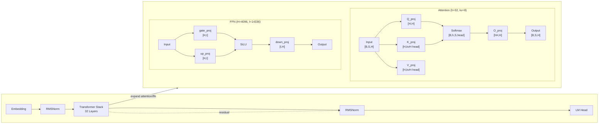

# LLM Architecture Generator - Design Specification

## Overview

A Claude Code skill that generates professional multi-level model architecture diagrams from HuggingFace models, local model files, or user-defined configurations. The output uses Mermaid syntax with a **left-right layout**: macro view on the left shows the overall structure, micro view on the right expands complex modules with detailed tensor shapes and connections.

---

## Invocation

### Standard Invocation (Claude Code Skill)

```
/llm-arch-generator <model> [-v|-vv|-vvv] [--format png,svg,mmd] [--output /path/to/dir]
```

### Natural Language Invocation

When users describe what they want in natural language, the skill interprets:

| User says | Interpreted as |
|-----------|----------------|
| "Draw / generate / plot the architecture of {model}" | Standard generation |
| "Show detailed layers / expanded view / with all projections" | `-vvv` |
| "Simple / high-level / macro view only" | `-v` |
| "Show attention and FFN details" | `-vv` (default) |
| "Save to {path}" | `--output /path` |
| "PNG / SVG / Mermaid format" | `--format` |

**Examples:**

```markdown
# Standard invocation
/llm-arch-generator KimiML/kimi-k2-5

# With detail level
/llm-arch-generator meta-llama/Llama-3-8b -vvv

# Natural language (interpreted equivalently)
/llm-arch-generator Generate a detailed architecture diagram for Kimi-K2.5 with all projection layers

# Both produce identical output for: KimiML/kimi-k2-5 -vvv
```

---

## Detail Levels

| Flag | Expansion | Use Case |
|------|-----------|----------|
| `-v` | Collapse to major blocks (Attention, FFN/MoE) | Quick overview, paper figure |
| `-vv` | Expand projection layers (Q/K/V/O, gate/up/down) | Default, recommended |
| `-vvv` | Full expansion including reshape, activation, softmax ops | Deep analysis |

### `-v` (Collapsed)

```
┌─────────────────────────────────────────────────────────────────────┐
│                         LLaMA-3-8B Architecture                      │
│                                                                     │
│  Embed ──► RMSNorm ──► [Attention] ──► [FFN] ──► RMSNorm ──► LM   │
│                              │                │                       │
│                              └───── add ──────┘                       │
│                                                                     │
│  Stack: 32 layers                                                    │
└─────────────────────────────────────────────────────────────────────┘
```

### `-vv` (Projection Layers, recommended default)

```
┌────────────────────────┬────────────────────────────────────────────┐
│      MACRO VIEW        │             MICRO VIEW                     │
│                        │                                             │
│  Embed ──► Norm ──►    │   Attention (h=32, kv=8):                   │
│  Stack(32) ──► Norm    │     Input[B,S,H]                            │
│  ──► LM               │       ├─► Q[B,S,H] @ H×H                     │
│                        │       ├─► K[B,S,kvH] @ H×(kvH·head_dim)    │
│                        │       ├─► V[B,S,kvH] @ H×(kvH·head_dim)    │
│                        │       └─► O[B,S,H] @ (h·head_dim)×H         │
│                        │                                             │
│  Cross-ref:            │   FFN (H=4096, I=14336):                     │
│  Stack ──► Micro      │     Input ──► gate[H×I]                       │
│                        │     Input ──► up[H×I] ──► SiLU ──► down     │
└────────────────────────┴────────────────────────────────────────────┘
```

### `-vvv` (Fully Expanded)

Adds reshape operations, softmax, and full tensor shape propagation.

---

## Information Extraction

### Shape Inference: config.json + model.py Combined

Shape inference **must combine** both sources — not config.json alone.

**From config.json:**
- `hidden_size` (H)
- `num_hidden_layers`
- `intermediate_size` (I)
- `num_attention_heads`
- `num_key_value_heads` (for GQA)
- `head_dim` = H / num_attention_heads

**From model.py:**

model.py contains **full tensor definitions** that enable precise shape calculation:

```python
# Example from modeling_llama.py
class LlamaAttention(nn.Module):
    def __init__(self, config):
        self.hidden_size = config.hidden_size
        self.num_heads = config.num_attention_heads
        self.head_dim = config.hidden_size // config.num_attention_heads

        # These are the actual tensor shapes defined in code:
        self.q_proj = nn.Linear(H, H)           # [H, H]
        self.k_proj = nn.Linear(H, kvH * head_dim)  # [H, kvH * head_dim]
        self.v_proj = nn.Linear(H, kvH * head_dim)  # [H, kvH * head_dim]
        self.o_proj = nn.Linear(H, H)            # [H, H]

# Attention output shape after reshape:
# [B, S, num_heads, head_dim] → transpose → [B, num_heads, S, head_dim]
```

**Correct shape annotations:**

| Layer | Shape |
|-------|-------|
| Q_proj weight | `[H, H]` or `[H, num_heads × head_dim]` |
| K_proj weight | `[H, num_key_value_heads × head_dim]` |
| V_proj weight | `[H, num_key_value_heads × head_dim]` |
| O_proj weight | `[H, num_heads × head_dim]` |
| Attention output (after softmax) | `[B, num_heads, S, head_dim]` |
| FFN gate/up | `[H, intermediate_size]` |
| FFN down | `[intermediate_size, H]` |

**Attention Score Shape (corrected):**

The user's correction applies:
- MHA: `[B, num_heads, S, head_dim]` (NOT `[B, num_heads, S, S]`)
- After attention: `[B, num_heads, S, head_dim]` → reshape to `[B, S, H]`

### Residual Connection Detection from model.py

Residual connections must be derived from **actual code analysis**, not assumptions:

**Pre-norm pattern (LLaMA, Qwen, Kimi):**

```python
# Identified from model.py forward():
input = layer_norm(input)
output = attention(input)
input = input + output          # residual add here
output = mlp(input)
input = input + output          # residual add here
input = layer_norm(input)
```

**Post-norm pattern (GLM, some GPT variants):**

```python
# Identified from model.py forward():
output = attention(input)
input = norm(input + output)    # residual then norm
```

**Short-cut / skip connection patterns:**

```python
# Identified from model.py:
if self.use_stable_embedding:
    input = self.conv(input)    # conv shortcut
output = output + input        # element-wise add
```

AI must read the actual `forward()` method and identify:
- Which tensor flows into which module
- Where `add` / `+` / `subtract` operations occur
- Which tensors are added together (residual source and destination)
- Conditional branches (training vs inference paths)

---

## Mermaid Syntax

### Left-Right Layout

The diagram uses `graph LR` (left-to-right) for the top-level layout.

**Macro-Micro cross-reference:**



### Residual Connection Display

Residual connections are rendered as **dashed edges** with annotations describing the relationship:

```mermaid
    %% Pre-norm residual (from model.py analysis)
    N1["RMSNorm"] -.->|"input + attention(input)"| Add1["Add"]
    Attn --> Add1

    %% Post-norm residual
    Add2["Add"] -.->|"norm(input + sublayer(input))"| N2["RMSNorm"]
```

**Key principle:** The exact residual pattern (pre-norm, post-norm, shortcut) is determined by reading model.py, not by assumption.

### Color Conventions

| Module Type | Fill | Border |
|-------------|------|--------|
| Transformer Stack | #f9f9f9 | #333 |
| Attention | #e1f5ff | #333 |
| FFN / MLP | #fff4e1 | #333 |
| Norm (RMS/Layer) | #f5f5f5 | #333 |
| Residual (dashed) | — | #999 (dashed) |

---

## Components

### AI-Generated Components (SKILL.md instructs AI)

| Component | Responsibility |
|-----------|----------------|
| **Parser** | AI reads config.json, extracts H, I, num_heads, kv_heads, etc. |
| **Model Analyzer** | AI reads model.py, builds module tree, traces forward path |
| **Residual Detector** | AI reads forward() method, identifies add/shortcut operations |
| **Shape Calculator** | AI computes shapes from model.py weight definitions × config.json params |
| **Mermaid Generator** | AI generates left-right syntax per detail level |
| **Auto-completion** | AI fills missing info based on model family conventions |

### Script-Tool Components

| Component | File | Language | Purpose |
|-----------|------|----------|---------|
| **Downloader** | `scripts/download_model.py` | Python | Download config.json + model.py from HuggingFace |
| **Renderer** | `scripts/render_mermaid.sh` | Bash | Render .mmd → PNG/SVG via mermaid-cli |

### download_model.py

```python
#!/usr/bin/env python3
"""Download config.json and model.py from HuggingFace."""

import argparse
import os
from huggingface_hub import hf_hub_download

def download_model(model_id: str, output_dir: str = ".") -> tuple[str, str | None]:
    """
    Download config.json and modeling_*.py from HuggingFace.

    modeling_*.py naming pattern: modeling_<model_name>.py
    Examples:
      - meta-llama/Llama-3-8b → modeling_llama_3_8b.py
      - KimiML/kimi-k2-5 → modeling_kimi_k2_5.py
      - Qwen/Qwen2-7B → modeling_qwen2_7b.py
    """
    # 1. Download config.json
    config_path = hf_hub_download(repo_id=model_id, filename="config.json", local_dir=output_dir)

    # 2. Try to find modeling file (pattern: modeling_<name>.py)
    sanitized = model_id.lower().replace('/', '_').replace('-', '_').replace('.', '_')
    modeling_filename = f"modeling_{sanitized}.py"

    model_path = None
    # Try exact name first, then fallbacks
    for filename in [modeling_filename, "modeling.py", "modeling_llama.py"]:
        try:
            model_path = hf_hub_download(repo_id=model_id, filename=filename, local_dir=output_dir)
            break
        except Exception:
            continue

    return config_path, model_path

if __name__ == "__main__":
    parser = argparse.ArgumentParser(description="Download model files from HuggingFace")
    parser.add_argument("model_id", help="e.g., meta-llama/Llama-3-8b")
    parser.add_argument("--output-dir", default="./downloaded")
    args = parser.parse_args()

    config, model = download_model(args.model_id, args.output_dir)
    print(f"config.json: {config}")
    print(f"modeling_*.py: {model}")
```

---

## Invocation Interface

### Parameters

| Parameter | Description | Default |
|-----------|-------------|---------|
| `model` | HuggingFace ID, local path, or YAML file | Required |
| `-v` | Collapsed view (Attention/FFN blocks only) | — |
| `-vv` | Projection-level view (default) | Default |
| `-vvv` | Fully expanded view (all ops) | — |
| `--format` | Output formats (comma-separated) | png,svg,mmd |
| `--output` | Output directory | Current directory |

### Examples

```bash
# Standard invocations
/llm-arch-generator KimiML/kimi-k2-5
/llm-arch-generator meta-llama/Llama-3-8b -vvv
/llm-arch-generator Qwen/Qwen2-7B -v --format png

# With output directory
/llm-arch-generator /path/to/local/model --output ./diagrams

# Natural language equivalents
/llm-arch-generator Draw a detailed architecture diagram for Kimi-K2.5 with all projection layers
/llm-arch-generator Generate a simple macro view of LLaMA-3 architecture
/llm-arch-generator Plot the architecture of Qwen2-7B and save to ./qwen_arch
```

---

## Output Files

```
{output_dir}/
├── {model_name}_arch.png    # Rendered raster image
├── {model_name}_arch.svg    # Rendered vector image
└── {model_name}_arch.mmd    # Mermaid source (always generated)
```

---

## File Structure

```
llm-arch-generator/
├── SKILL.md                         # AI instructions (main entry)
├── docs/superpowers/
│   └── specs/
│       └── 2026-03-26-llm_arch_generator-design.md
├── scripts/
│   ├── download_model.py            # HuggingFace file downloader
│   ├── render_mermaid.sh            # Mermaid CLI renderer (existing)
│   └── render_mermaid.ps1           # Windows renderer (existing)
└── templates/                        # Model family templates (existing)
    ├── llama/common.yaml
    ├── mistral/common.yaml
    └── ...
```

---

## Workflow

```
1. User invokes /llm-arch-generator <model> [options]
            │
            ▼
2. Parse invocation (standard CLI or natural language)
            │
            ▼
3. (If HuggingFace) Script: download_model.py
   - config.json → parse H, I, num_heads, kv_heads, layers
   - model.py → parse tensor shapes, module tree, forward path
            │
            ▼
4. AI: Extract module hierarchy from model.py
   - nn.Module tree (attention → q/k/v/o_proj, mlp → gate/up/down_proj)
            │
            ▼
5. AI: Trace forward() path
   - Identify data flow: input → ... → output
   - Identify residual adds: input + SubLayer(input)
   - Identify conditionals (training/inference branches)
            │
            ▼
6. AI: Calculate shapes
   - Weight shapes from model.py (Linear layers)
   - Activation shapes from config.json (H, I, head_dim)
   - Propagation: [B, S, H] through each op
            │
            ▼
7. AI: Generate Mermaid syntax
   - Left-right layout (graph LR)
   - Macro view: Embed → Stack → Norm → LM Head
   - Micro view: expanded modules with shapes
   - Residual dashed edges with annotations
   - Respects -v/-vv/-vvv detail level
            │
            ▼
8. Write {model_name}_arch.mmd
            │
            ▼
9. (If --format includes png/svg) Script: render_mermaid.sh → PNG/SVG
            │
            ▼
10. Output files to {output_dir}/
```

### Fallback Path

If model.py is not available (only权重 files):
- AI infers structure from config.json + model family template
- Shape calculations use family conventions (H, I, head_dim relationships)
- Residual patterns use family defaults (pre-norm for LLaMA, post-norm for GLM)
- Note: precision reduced, model.py analysis preferred

---

## Backward Compatibility

- Existing `--format` and `--output` parameters unchanged
- Existing `templates/*.yaml` structure unchanged
- Existing YAML config input unchanged
- Detail level flag new: `-v`/`-vv`/`-vvv` (default `-vv`)

---

## Summary: AI vs Script Responsibilities

| Task | Responsibility |
|------|----------------|
| Parse config.json | **AI** |
| Read model.py | **AI** (directly reads file) |
| Analyze module hierarchy | **AI** |
| Trace forward path | **AI** |
| Detect residual connections | **AI** (from model.py forward() analysis) |
| Calculate tensor shapes | **AI** (from model.py weight definitions × config.json params) |
| Generate Mermaid syntax | **AI** |
| Interpret natural language | **AI** |
| Download HuggingFace files | **Script** (Python) |
| Render PNG/SVG | **Script** (Bash + mermaid-cli) |
| Auto-fill missing parameters | **AI** (from model family knowledge) |
