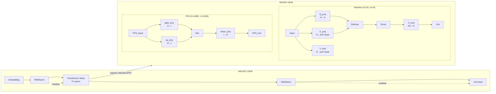

# LLM Architecture Generator - Design Specification

## Overview

A Claude Code skill that generates professional multi-level model architecture diagrams from HuggingFace models, local model files, or user-defined configurations. The output uses Mermaid syntax with a left-right layout: macro view on the left shows the overall structure, micro view on the right expands complex modules with detailed tensor shapes and connections.

---

## Architecture

### Design Principles

1. **AI-driven generation**: The skill is prompt-based — AI reads model files and generates Mermaid syntax following SKILL.md instructions
2. **Script-assisted downloading**: Python scripts handle HuggingFace file downloads
3. **Multi-level visualization**: Users can configure detail depth from collapsed (Attention/FFN level) to fully expanded (every projection layer)

### Overall Layout

```
┌─────────────────────────────────────────────────────────────────────────┐
│                            MACRO VIEW (Left)                            │
│                                                                         │
│   Embed ──► RMSNorm ──► Stack ──► RMSNorm ──► LM Head                 │
│                      (N layers)                                        │
│                        │                                                │
│                        ▼ [cross-ref]                                    │
│               ┌────────────────┐                                         │
│               │  see Micro    │                                         │
│               └────────────────┘                                         │
└─────────────────────────────────────────────────────────────────────────┘
                                           │
                                           ▼
┌─────────────────────────────────────────────────────────────────────────┐
│                           MICRO VIEW (Right)                            │
│                                                                         │
│   Expanded complex modules (Attention, FFN, MoE, etc.)                 │
│   with full tensor shape annotations                                   │
└─────────────────────────────────────────────────────────────────────────┘
```

---

## Input Sources

### HuggingFace Model ID

1. Download `config.json` from HuggingFace Hub
2. Locate `modeling_*.py` in the same repo directory
   - Pattern: `modeling_<model_name>.py`
   - Examples:
     - LLaMA: `modeling_llama.py`
     - Kimi-K2.5: `modeling_kimi_k25.py`
     - Qwen: `modeling_qwen2.py`
3. AI parses both files to extract structure

**Download script**: `scripts/download_model.py`

```python
# Key logic for finding modeling file
modeling_filename = f"modeling_{sanitized_model_id}.py"
# Also try: modeling.py, modeling_{family}.py as fallbacks
```

### Local Files

| Input Type | Handling |
|------------|----------|
| Directory path | Look for `config.json` and `modeling_*.py` in that directory |
| `*.yaml` file | Use as-is (existing YAML config support) |
| `config.json` path | Read directly |

### User-Defined YAML Config

Unchanged from original design — fully customizable model structure.

---

## Detail Levels

| Level | Expansion | Example |
|-------|-----------|---------|
| `--detail-level 1` | Expand to major sub-modules | `Attention` (shows Q/K/V/O but not their shapes) |
| `--detail-level 2` | Expand to projection layers | `Q_proj[H,H]`, `K_proj[H,kvH]`, `FFN gate→up→down` |
| `--detail-level 3` | Full expansion | Adds activation functions, softmax, reshape operations |

### Level 2 Example Output (recommended default)

```
Attention (h=32, kv=8):
  Input[B,S,H] ──► Q_proj[H,H]
                  ──► K_proj[H,kvH·head_dim]
                  ──► V_proj[H,kvH·head_dim]
                  ──► Softmax(Q·Kᵀ/√d)
                  ──► O_proj[hH,H] ──► Output[B,S,H]

FFN (H=4096, I=14336):
  Input ──► gate_proj[H,I]
  Input ──► up_proj[H,I] ──► SiLU ──► down_proj[I,H] ──► Output
```

---

## Information Extracted from model.py

AI analyzes the `modeling_*.py` file to extract:

### 1. Module Hierarchy (nn.Module tree)

```
LlamaModel
├── LlamaLayers
│   ├── LlamaAttention
│   │   ├── q_proj
│   │   ├── k_proj
│   │   ├── v_proj
│   │   └── o_proj
│   ├── LlamaMlp
│   │   ├── gate_proj
│   │   ├── up_proj
│   │   └── down_proj
│   └── LlamaRMSNorm
└── lm_head
```

### 2. Forward Path (tensor flow)

```python
# From forward() method, trace:
input_ids → embed_tokens()
         → layer(input)           # repeat N times
         → LlamaRMSNorm()
         → lm_head()
```

### 3. Tensor Shape Propagation

For each node, determine input/output shapes:
- `Q_proj: [B, S, H] → [B, S, H]`
- `Attention Score: [B, num_heads, S, S]`
- `Output_proj: [B, S, H] → [B, S, H]`

### 4. Residual Connections

Identify `add` operations in the forward pass:
- Pre-norm: `output = input + SubLayer(LayerNorm(input))`
- Post-norm: `output = LayerNorm(input + SubLayer(input))`
- Shortcut: `output = input + attention(input)` (direct skip)

### 5. Conditional Branches

Detect training/inference differences:
- Dropout presence
- Gradient checkpointing
- KV cache usage in generation

---

## Mermaid Syntax Structure

### Layout: Left-Right Split



### Shape Annotation Format

| Module | Format | Example |
|--------|--------|---------|
| Projection | `name<br/>in_shape→out_shape` | `Q_proj<br/>4096→4096` |
| Attention | `Attention<br/>h=N, kv=N` | `Attention<br/>h=32, kv=8` |
| FFN | `FFN<br/>H=I→O` | `FFN<br/>4096→14336→4096` |
| Tensor | `[B,S,H]` | `[B,8192,4096]` |

### Color Conventions

| Module Type | Fill | Border |
|-------------|------|--------|
| Transformer Stack | #f9f9f9 | #333 |
| Attention | #e1f5ff | #333 |
| FFN / MLP | #fff4e1 | #333 |
| Norm (RMS/Layer) | #f5f5f5 | #333 |
| Residual (dashed) | — | #999 (dashed) |

---

## Components

### AI-Generated Components (SKILL.md instructs AI)

| Component | Responsibility |
|-----------|----------------|
| **Parser** | AI reads config.json, extracts parameters |
| **Module Analyzer** | AI reads model.py, builds module tree, traces forward path |
| **Residual Detector** | AI identifies add/shortcut operations |
| **Shape Calculator** | AI computes tensor shapes at each layer |
| **Mermaid Generator** | AI generates syntax per detail-level |
| **Auto-completion** | AI fills missing info based on model family conventions |

### Script-Tool Components

| Component | File | Language | Purpose |
|-----------|------|----------|---------|
| **Downloader** | `scripts/download_model.py` | Python | Download config.json + modeling_*.py from HuggingFace |
| **Renderer** | `scripts/render_mermaid.sh` | Bash | Render .mmd → PNG/SVG via mermaid-cli |

### download_model.py

```python
#!/usr/bin/env python3
"""Download config.json and modeling_*.py from HuggingFace."""

import argparse
import os
from huggingface_hub import hf_hub_download

def download_model(model_id: str, output_dir: str = ".") -> tuple[str, str | None]:
    # Download config.json
    config_path = hf_hub_download(repo_id=model_id, filename="config.json", local_dir=output_dir)

    # Try to find modeling file (pattern: modeling_<name>.py)
    model_filename = f"modeling_{model_id.lower().replace('/', '_').replace('-', '_').replace('.', '_')}.py"
    model_path = None
    for filename in [model_filename, "modeling.py", "modeling_llama.py"]:
        try:
            model_path = hf_hub_download(repo_id=model_id, filename=filename, local_dir=output_dir)
            break
        except Exception:
            continue

    return config_path, model_path

if __name__ == "__main__":
    parser = argparse.ArgumentParser()
    parser.add_argument("model_id", help="e.g., meta-llama/Llama-3-8b")
    parser.add_argument("--output-dir", default="./downloaded")
    args = parser.parse_args()

    config, model = download_model(args.model_id, args.output_dir)
    print(f"config.json: {config}")
    print(f"modeling_*.py: {model}")
```

---

## Invocation Interface

### Command Syntax

```
/llm-arch-generator <model> [--format png,svg,mmd] [--output /path/to/dir] [--detail-level 1|2|3]
```

### Parameters

| Parameter | Description | Default |
|-----------|-------------|---------|
| `model` | HuggingFace ID, local path, or YAML file | Required |
| `--format` | Output formats | png,svg,mmd |
| `--output` | Output directory | Current directory |
| `--detail-level` | Expansion depth (1=collapsed, 3=fully expanded) | 2 |

### Examples

```bash
# Basic: Kimi-K2.5 with default detail-level 2
/llm-arch-generator KimiML/kimi-k2-5

# Fully expanded for deep analysis
/llm-arch-generator meta-llama/Llama-3-8b --detail-level 3

# Only macro view (no micro expansion)
/llm-arch-generator Qwen/Qwen2-7B --detail-level 1

# Local files
/llm-arch-generator /path/to/local/model --output ./diagrams
```

---

## Output Files

```
{output_dir}/
├── {model_name}_arch.png    # Rendered raster image
├── {model_name}_arch.svg    # Rendered vector image
└── {model_name}_arch.mmd    # Mermaid source (always generated)
```

---

## File Structure

```
llm-arch-generator/
├── SKILL.md                         # AI instructions (this file is the skill)
├── docs/superpowers/
│   └── specs/
│       └── 2026-03-26-llm_arch_generator-design.md
├── scripts/
│   ├── download_model.py            # HuggingFace file downloader
│   ├── render_mermaid.sh            # Mermaid CLI renderer (existing)
│   └── render_mermaid.ps1           # Windows PowerShell renderer (existing)
└── templates/                        # Model family templates (existing)
    ├── llama/common.yaml
    ├── mistral/common.yaml
    └── ...
```

---

## Workflow

```
1. User invokes /llm-arch-generator <model> [options]
            │
            ▼
2. Script: download_model.py (if HuggingFace)
            │
            ▼
3. AI: Read config.json  ──────────────────────┐
            │                                   │
            ▼                                   │ (if HuggingFace)
4. AI: Read modeling_*.py (if available)       │
            │                                   │
            ▼                                   │
5. AI: Extract module hierarchy                 │
6. AI: Trace forward path                      │
7. AI: Detect residual connections            │
8. AI: Calculate tensor shapes                 │
            │                                   │
            ▼                                   │
9. AI: Generate Mermaid syntax                  │
   (respects --detail-level)                   │
            │
            ▼
10. Write {model_name}_arch.mmd
            │
            ▼
11. Script: render_mermaid.sh → PNG/SVG (if --format includes them)
            │
            ▼
12. Output files to {output_dir}/
```

### Fallback Path

If `modeling_*.py` is not available (only权重文件):
- AI infers structure from `config.json` + model family template
- Module details (projection shapes, residual paths) use family conventions
- `--detail-level` still applies but with less precision

---

## Backward Compatibility

- Existing `--format` and `--output` parameters unchanged
- Existing `templates/*.yaml` structure unchanged
- Existing YAML config input unchanged
- New `--detail-level` parameter has sensible default (2)

---

## Summary: AI vs Script Responsibilities

| Task | Responsibility |
|------|----------------|
| Parse config.json | **AI** |
| Read model.py | **AI** (directly reads file) |
| Analyze module hierarchy | **AI** |
| Trace forward path | **AI** |
| Detect residual connections | **AI** |
| Calculate tensor shapes | **AI** |
| Generate Mermaid syntax | **AI** |
| Download HuggingFace files | **Script** (Python) |
| Render PNG/SVG | **Script** (Bash + mermaid-cli) |
| Auto-fill missing parameters | **AI** (from model family knowledge) |
