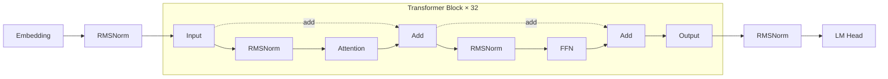
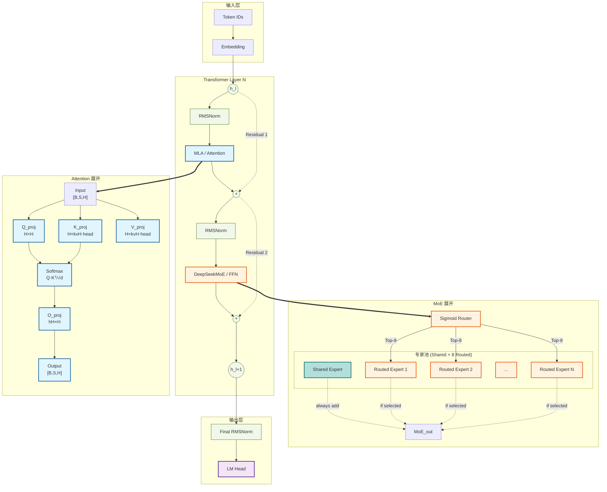

# LLM Architecture Generator - Design Specification

## Overview

A Claude Code skill that generates professional multi-level model architecture diagrams from HuggingFace models, local model files, or user-defined configurations. The output uses Mermaid syntax with a **left-right layout**: Level 1 shows individual Attention/FFN/MoE/MLP modules grouped by layer count, Level 2 expands each module to projection layers.

---

## Invocation

### Standard Invocation (Claude Code Skill)

```
/llm-arch-generator <model> [-v|-vv] [--format png,svg,mmd] [--output /path/to/dir]
```

### Natural Language Invocation

When users describe what they want in natural language, the skill interprets:

| User says | Interpreted as |
|-----------|----------------|
| "Draw / generate / plot the architecture of {model}" | Standard generation with `-vv` |
| "Simple / high-level / macro / collapsed view" | `-v` |
| "Detailed / expanded / with projections" | `-vv` |
| "Save to {path}" | `--output /path` |
| "PNG / SVG / Mermaid format" | `--format` |

**Examples:**

```markdown
# Standard invocation (default: -vv)
/llm-arch-generator KimiML/kimi-k2-5

# Collapsed view (-v)
/llm-arch-generator meta-llama/Llama-3-8b -v

# Expanded view (-vv, explicit)
/llm-arch-generator Qwen/Qwen2-7B -vv

# Natural language equivalents
/llm-arch-generator Draw a detailed architecture diagram for Kimi-K2.5
/llm-arch-generator Generate a simple macro view of LLaMA-3
/llm-arch-generator Plot the architecture of Qwen2-7B and save to ./qwen_arch
```

---

## Detail Levels

Two levels only. Level 1 shows the block structure with residual connections; Level 2 expands the internal modules.

### `-v` (Collapsed, Level 1)

Shows individual **Attention**, **FFN** (or **MoE**, **MLP**) modules visible in the flow, with a dashed box grouping them labeled `× N layers`. Residual connections are shown at this level.

```
Embed ──► Norm ──► Input ──► RMSNorm ──► [Attention] ──► [FFN] ──► Output
                   │               │               │               │
                   └───────┬──────┴───────┬───────┘               │
                           │   add(pre)   │                       │
                           └──────────────┘                       │
                         ┌────────────────────────────────┐
                         │    Transformer Block × 32        │  ← dashed box
                         └────────────────────────────────┘
                                           │
                                     Norm ──► LM Head
```

**Key:** Level 1 directly shows Attention/FFN/MoE/MLP modules in the flow (not a black-box "Stack"), with a dashed border indicating they repeat N times. Residual add paths are visible.

### `-vv` (Expanded, Level 2)

Top-down layout. Level 1 shows one transformer layer path (left/top). Complex modules (Attention, MoE/FFN) expand to detailed views (right/bottom) via `==>` arrows.

```
Level 1 (Left/Top):
  Embed ──► RMSNorm ──► [Attention] ──► [FFN/MoE] ──► RMSNorm ──► LM Head
                              ↑              ↑
                         Residual 1      Residual 2

Level 2 (展开 via ==>)：
  Attention ──► Q_proj, K_proj, V_proj, O_proj + Softmax
  MoE ──► Router + Expert Pool (Shared + Routed)
  FFN ──► gate_proj, up_proj, down_proj + activation
```

---

## Information Extraction

### Shape Inference: config.json + model.py Combined

Shape inference **must combine** both sources — not config.json alone.

**From config.json:**
- `hidden_size` (H)
- `num_hidden_layers`
- `intermediate_size` (I)
- `num_attention_heads`
- `num_key_value_heads` (for GQA)
- `head_dim` = H / num_attention_heads

**From model.py:**

model.py contains **full tensor definitions** that enable precise shape calculation:

```python
# Example from modeling_llama.py
class LlamaAttention(nn.Module):
    def __init__(self, config):
        self.hidden_size = config.hidden_size
        self.num_heads = config.num_attention_heads
        self.head_dim = config.hidden_size // config.num_attention_heads

        # These are the actual tensor shapes defined in code:
        self.q_proj = nn.Linear(H, H)           # [H, H]
        self.k_proj = nn.Linear(H, kvH * head_dim)  # [H, kvH * head_dim]
        self.v_proj = nn.Linear(H, kvH * head_dim)  # [H, kvH * head_dim]
        self.o_proj = nn.Linear(H, H)            # [H, H]
```

**Correct shape annotations:**

| Layer | Shape |
|-------|-------|
| Q_proj weight | `[H, H]` or `[H, num_heads × head_dim]` |
| K_proj weight | `[H, num_key_value_heads × head_dim]` |
| V_proj weight | `[H, num_key_value_heads × head_dim]` |
| O_proj weight | `[H, num_heads × head_dim]` |
| Attention output (after softmax) | `[B, num_heads, S, head_dim]` |
| FFN gate/up | `[H, intermediate_size]` |
| FFN down | `[intermediate_size, H]` |

### Residual Connection Detection from model.py

Residual connections must be derived from **actual code analysis**, not assumptions:

**Pre-norm pattern (LLaMA, Qwen, Kimi):**

```python
# Identified from model.py forward():
input = layer_norm(input)
output = attention(input)
input = input + output          # residual add here
output = mlp(input)
input = input + output          # residual add here
input = layer_norm(input)
```

**Post-norm pattern (GLM, some GPT variants):**

```python
# Identified from model.py forward():
output = attention(input)
input = norm(input + output)    # residual then norm
```

AI must read the actual `forward()` method and identify:
- Which tensor flows into which module
- Where `add` / `+` / `subtract` operations occur
- Which tensors are added together (residual source and destination)
- Conditional branches (training vs inference paths)

---

## Mermaid Syntax

### Level 1: Block Structure with Residual Connections



**Key:** `subgraph TB` with `style TB dashed` shows the repeated modules with a dashed border. Attention and FFN are visible inside — NOT hidden in a black-box node.

### Level 2: Module Expansion

Level 1 structure (top-down), with complex modules (MoE, Attention) expanded on the right via `==>` relationship arrows.



### Color Conventions

Mermaid `classDef` style definitions used in diagrams:

```mermaid
classDef attention fill:#e1f5ff,stroke:#01579b,stroke-width:2px;
classDef moe fill:#fff3e0,stroke:#e65100,stroke-width:2px;
classDef shared_expert fill:#b2dfdb,stroke:#00695c,stroke-width:2px;
classDef ffn fill:#fff4e1,stroke:#333,stroke-width:2px;
classDef norm fill:#f1f8e9,stroke:#33691e,stroke-width:1px;
classDef input_stage fill:#f3e5f5,stroke:#4a148c,stroke-width:2px;
classDef output_stage fill:#f3e5f5,stroke:#4a148c,stroke-width:2px;
```

| Module Type | Fill | Border | Usage |
|-------------|------|--------|-------|
| Attention | #e1f5ff | #01579b | MLA, Q/K/V/O projections, Softmax |
| MoE | #fff3e0 | #e65100 | Router, Routed Experts |
| Shared Expert | #b2dfdb | #00695c | Shared Expert (always active) |
| FFN / MLP | #fff4e1 | #333 | gate/up/down_proj |
| Norm | #f1f8e9 | #33691e | RMSNorm, LayerNorm |
| Input/Output | #f3e5f5 | #4a148c | Embedding, LM Head |
| Residual | dashed | #999 | `-.->` arrows |
| Expand relation | solid bold | — | `==>` arrows (Level 1 → Level 2) |

---

## Components

### AI-Generated Components (SKILL.md instructs AI)

| Component | Responsibility |
|-----------|----------------|
| **Parser** | AI reads config.json, extracts H, I, num_heads, kv_heads, layers |
| **Model Analyzer** | AI reads model.py, builds module tree, traces forward path |
| **Residual Detector** | AI reads forward() method, identifies add/shortcut operations |
| **Shape Calculator** | AI computes shapes from model.py weight definitions × config.json params |
| **Mermaid Generator** | AI generates left-right syntax per detail level |
| **Auto-completion** | AI fills missing info based on model family conventions |

### Script-Tool Components

| Component | File | Language | Purpose |
|-----------|------|----------|---------|
| **Downloader** | `scripts/download_model.py` | Python | Download config.json + model.py from HuggingFace |
| **Renderer** | `scripts/render_mermaid.sh` | Bash | Render .mmd → PNG/SVG via mermaid-cli |

### download_model.py

```python
#!/usr/bin/env python3
"""Download config.json and model.py from HuggingFace with caching.

model.py can be anywhere in the repo tree. This script uses list_repo_files()
to scan the entire repository (all subdirectories) and locate the modeling file.
"""

import argparse
import os
from pathlib import Path
from huggingface_hub import hf_hub_download, list_repo_files

CACHE_DIR = Path.home() / ".cache" / "llm_arch_generator"

def get_cache_path(model_id: str, filename: str) -> Path:
    """Get local cache path for a downloaded file."""
    safe_id = model_id.replace('/', '_').replace('-', '_')
    return CACHE_DIR / safe_id / filename

def find_modeling_file(model_id: str) -> str | None:
    """
    Find the modeling file by scanning the entire repository.

    Uses list_repo_files() to get all files recursively, then matches:
      - model.py
      - modeling.py
      - modeling_<anything>.py

    This handles any directory layout (src/, inference/, flash_attention/, etc.).
    Returns the full path in the repo if found, None otherwise.
    """
    # Get all files in the repo
    try:
        all_files = list_repo_files(model_id)
    except Exception:
        return None

    # Patterns that indicate a modeling file
    modeling_patterns = [
        'model.py',
        'modeling.py',
    ]

    for f in all_files:
        filename = os.path.basename(f)
        if filename in modeling_patterns:
            return f
        # Also match modeling_<something>.py
        if filename.startswith('modeling_') and filename.endswith('.py'):
            return f

    return None

def download_model(
    model_id: str,
    output_dir: str = None,
    use_cache: bool = True
) -> tuple[str, str | None]:
    """
    Download config.json and model.py from HuggingFace.

    Caches to ~/.cache/llm_arch_generator/{model_id}/
    Clear cache by deleting that directory.
    """
    # Determine output directory (use cache if not specified)
    if output_dir is None:
        out_path = CACHE_DIR / model_id.replace('/', '_').replace('-', '_')
    else:
        out_path = Path(output_dir)

    out_path.mkdir(parents=True, exist_ok=True)

    # 1. Download config.json
    config_cache = get_cache_path(model_id, "config.json")
    if use_cache and config_cache.exists():
        import shutil
        dest = out_path / "config.json"
        shutil.copy(config_cache, dest)
        config_path = str(dest)
    else:
        config_path = hf_hub_download(
            repo_id=model_id,
            filename="config.json",
            local_dir=str(out_path)
        )
        config_cache.parent.mkdir(parents=True, exist_ok=True)
        import shutil
        shutil.copy(config_path, str(config_cache))

    # 2. Find and download modeling file
    # First try to find the filename in the repo
    modeling_filename = find_modeling_file(model_id)

    model_path = None
    if modeling_filename:
        model_cache = get_cache_path(model_id, modeling_filename.replace('/', '_'))
        if use_cache and model_cache.exists():
            import shutil
            dest = out_path / os.path.basename(modeling_filename)
            shutil.copy(model_cache, dest)
            model_path = str(dest)
        else:
            try:
                model_path = hf_hub_download(
                    repo_id=model_id,
                    filename=modeling_filename,
                    local_dir=str(out_path)
                )
                model_cache.parent.mkdir(parents=True, exist_ok=True)
                import shutil
                shutil.copy(model_path, str(model_cache))
            except Exception:
                model_path = None

    return config_path, model_path

if __name__ == "__main__":
    parser = argparse.ArgumentParser(description="Download model files from HuggingFace")
    parser.add_argument("model_id", help="e.g., meta-llama/Llama-3-8b")
    parser.add_argument("--output-dir", default=None, help="Output directory (default: cache)")
    parser.add_argument("--no-cache", action="store_true", help="Bypass cache")
    args = parser.parse_args()

    config, model = download_model(
        args.model_id,
        args.output_dir,
        use_cache=not args.no_cache
    )
    print(f"config.json: {config}")
    print(f"modeling_*.py: {model}")
```

---

## Invocation Interface

### Parameters

| Parameter | Description | Default |
|-----------|-------------|---------|
| `model` | HuggingFace ID, local path, or YAML file | Required |
| `-v` | Level 1: collapsed block structure with residual connections | — |
| `-vv` | Level 2: expanded module internals (default) | Default |
| `--format` | Output formats (comma-separated) | png,svg,mmd |
| `--output` | Output directory | Current directory |

### Examples

```bash
# Default (-vv): expanded view
/llm-arch-generator KimiML/kimi-k2-5

# Level 1 (-v): collapsed with residual connections
/llm-arch-generator meta-llama/Llama-3-8b -v

# Level 2 (-vv): explicit expanded view
/llm-arch-generator Qwen/Qwen2-7B -vv

# With output format
/llm-arch-generator Qwen/Qwen2-7B --format png --output ./diagrams

# Local files
/llm-arch-generator /path/to/local/model --output ./diagrams
```

---

## Output Files

```
{output_dir}/
├── {model_name}_arch.png    # Rendered raster image
├── {model_name}_arch.svg    # Rendered vector image
└── {model_name}_arch.mmd    # Mermaid source (always generated)
```

---

## File Structure

```
llm-arch-generator/
├── SKILL.md                         # AI instructions (main entry)
├── docs/superpowers/
│   └── specs/
│       └── 2026-03-26-llm_arch_generator-design.md
├── scripts/
│   ├── download_model.py            # HuggingFace file downloader (with repo scanning)
│   ├── render_mermaid.sh            # Mermaid CLI renderer (existing)
│   └── render_mermaid.ps1          # Windows renderer (existing)
└── templates/                       # Model family templates (existing)
    ├── llama/common.yaml
    ├── mistral/common.yaml
    └── ...
```

---

## Workflow

```
1. User invokes /llm-arch-generator <model> [options]
            │
            ▼
2. Parse invocation (standard CLI or natural language)
            │
            ▼
3. (If HuggingFace) Script: download_model.py
   - config.json → parse H, I, num_heads, kv_heads, layers
   - model.py → scan repo with list_repo_files() to locate, then download
            │
            ▼
4. AI: Read model.py
   - Build module tree (Attention, FFN/MoE/MLP, projections)
   - Trace forward() path and residual connections
            │
            ▼
5. AI: Calculate shapes
   - Weight shapes from model.py (Linear layers)
   - Activation shapes from config.json (H, I, head_dim)
   - Propagation: [B, S, H] through each op
            │
            ▼
6. AI: Generate Mermaid syntax
   - Left-right layout (graph LR)
   - Level 1: Attention/FFN/MoE/MLP boxes in Transformer Block × N
   - Level 2: expanded projections with shapes
   - Respects -v/-vv detail level
            │
            ▼
7. Write {model_name}_arch.mmd
            │
            ▼
8. (If --format includes png/svg) Script: render_mermaid.sh → PNG/SVG
            │
            ▼
9. Output files to {output_dir}/
```

### Fallback Path

If model.py is not available (only权重 files):
- AI infers structure from config.json + model family template
- Shape calculations use family conventions (H, I, head_dim relationships)
- Residual patterns use family defaults (pre-norm for LLaMA, post-norm for GLM)
- Note: precision reduced, model.py analysis preferred

---

## Backward Compatibility

- Existing `--format` and `--output` parameters unchanged
- Existing `templates/*.yaml` structure unchanged
- Existing YAML config input unchanged
- Detail level flag new: `-v`/`-vv` (default `-vv`)

---

## Summary: AI vs Script Responsibilities

| Task | Responsibility |
|------|----------------|
| Parse config.json | **AI** |
| Locate model.py in repo (scan with list_repo_files) | **Script** |
| Read model.py | **AI** (directly reads file) |
| Analyze module hierarchy | **AI** |
| Trace forward path | **AI** |
| Detect residual connections | **AI** (from model.py forward() analysis) |
| Calculate tensor shapes | **AI** (from model.py weight definitions × config.json params) |
| Generate Mermaid syntax | **AI** |
| Interpret natural language | **AI** |
| Download HuggingFace files | **Script** (Python) |
| Render PNG/SVG | **Script** (Bash + mermaid-cli) |
| Auto-fill missing parameters | **AI** (from model family knowledge) |
