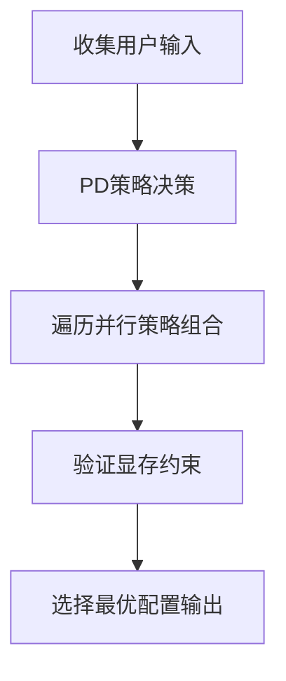
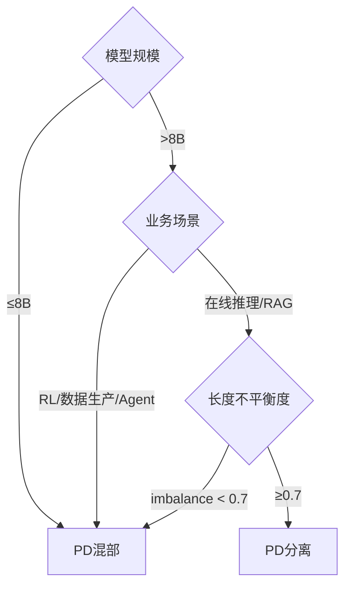
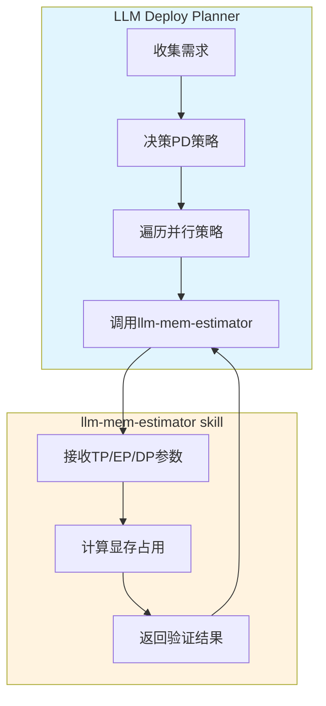
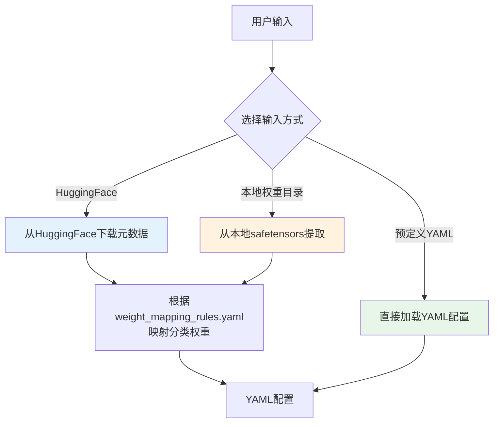
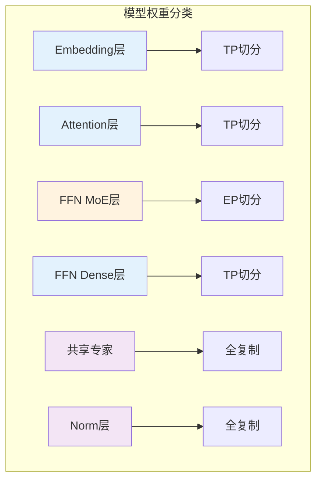
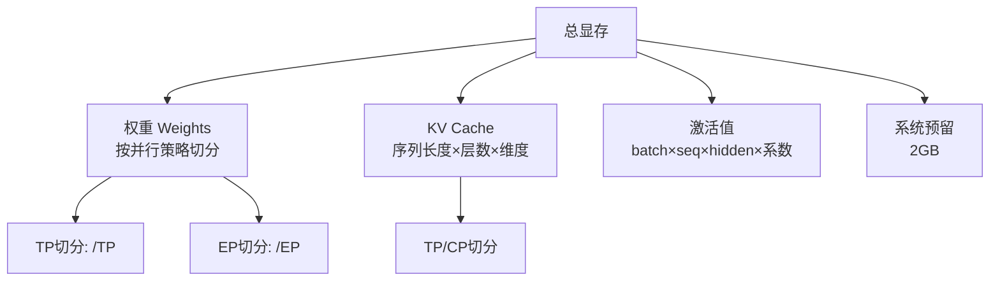
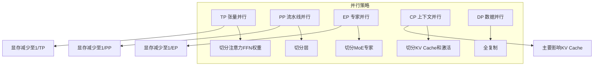
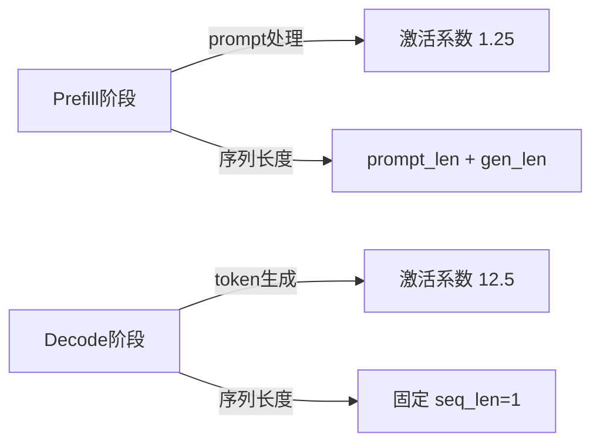

# LLM Deploy Planner 汇报材料

## 一、它是什么

LLM Deploy Planner 是一个 **Prompt-based 智能规划工具**，帮助规划 LLM 模型的推理部署方案。


---

## 二、工作原理

### 2.1 核心流程（5步法）



**输入信息**：
- 模型名称（Qwen-72B、Kimi-K2.5 等）
- 硬件配置（显存大小、单机卡数）
- 业务场景（RL、在线推理、Agent 等）
- 性能目标（TPS优先 / 时延优先）

### 2.2 PD 策略决策逻辑



**长度不平衡度计算**：
```
α = S_in / (S_in + k × S_out)
imbalance = max(α, 1-α)
```

### 2.3 与其他组件的协作



---

## 三、能做什么（优点）

| 能力 | 说明 |
|------|------|
| **PD 混部/分离自动决策** | 根据场景、长度比自动选择最优部署模式 |
| **并行策略智能遍历** | 自动尝试 TP×EP×DP 组合，找到可行配置 |
| **xPyD 实例数计算** | PD 分离时输出具体实例配比（如 4P1D） |
| **多硬件支持** | H100-80GB、A100-80GB、Ascend-910B-64GB 等 |
| **Fallback 机制** | llm-mem-estimator 不可用时仍能手动估算 |

**实际效果**：
- 有 skill 辅助：Pass Rate **100%**
- 无 skill 辅助：Pass Rate **83.3%**（MoE 模型易出错）

---

## 四、什么不能做（局限性）

| 限制 | 说明 |
|------|------|
| **仅支持推理** | 不能用于模型训练场景 |
| **依赖 llm-mem-estimator** | 该 skill 不可用时，估算精度下降 |
| **约束条件复杂** | TP/EP/DP 必须是2的幂，EP ≤ MoE expert数 |
| **Decode 实例数固定** | PD 分离时 Decode 实例数 y=1，不可调 |
| **无动态调整** | 不支持运行时根据负载动态调整配置 |

---

## 五、输出示例

规划完成后输出标准 Markdown 报告，包含：
- 输入摘要
- PD 策略决策理由
- 显存分析明细
- 并行策略配置（TP/EP/DP/实例数）
- 实现注意事项

---

## 六、llm-mem-estimator 核心原理

### 6.1 模型配置获取方式



**三种输入方式最终都生成/使用同一个 YAML 配置文件**：

| 来源 | CLI参数 | 说明 |
|------|---------|------|
| HuggingFace | `--model Qwen/Qwen2-72B` | 在线下载 + weight_mapping_rules 分类 → YAML |
| 本地权重 | `--local /path/to/weights` | 本地提取 + weight_mapping_rules 分类 → YAML |
| 预定义YAML | `--config configs/models/Kimi-K2.5.yaml` | 直接使用 |

**weight_mapping_rules.yaml 的核心作用**：
- 将**原始权重名称**（如 `model.layers.0.self_attn.q_proj.weight`）
- 按**规则映射**为标准的**模块类型**（embedding、attention、ffn_moe、ffn_dense、norm等）
- 支持自定义 YAML 直接定义，绕过此规则

### 6.2 权重分类与并行策略映射

显存估算的核心：**不同层的权重应用不同的并行策略**



**典型映射规则**（来自 `weight_mapping_rules.yaml`）：

| 权重类型 | 默认并行策略 | 说明 |
|----------|-------------|------|
| Embedding | TP | 词表维度切分 |
| Attention (Q/K/V/O) | TP | 注意力权重按TP切分 |
| FFN MoE Experts | **EP** | MoE专家按EP切分（关键！） |
| FFN Dense | TP | 前馈网络按TP切分 |
| 共享专家 | Replicated | 所有卡复制一份 |
| Norm层 | Replicated | 归一化层全复制 |

### 6.3 显存估算公式

```
总显存 = 权重(Weights) + KV Cache + 激活值(Activation) + 系统预留(2GB)
```



### 6.4 并行策略显存分布

**约束公式**：`TP × DP = EP = 总卡数`



### 6.5 PD 分离场景



| 阶段 | 激活系数 | 序列长度 |
|------|----------|----------|
| Prefill/混部 | 1.25 | prompt_len + gen_len |
| Decode | 12.5 | 1 (固定) |

### 6.6 支持的注意力架构

| 类型 | 说明 |
|------|------|
| MHA | 多头注意力 |
| MQA | 多查询注意力 |
| GQA | 分组查询注意力 |
| MLA | DeepSeek专用潜在注意力 |
| SWA | 滑动窗口注意力 |

---

## 七、技术栈

```
LLM Deploy Planner (SKILL.md - Prompt驱动)
         ↓ 调用
llm-mem-estimator (GPU显存估算Skill)
         ↓ 调用
       脚本层 (Python/YAML配置)
```
