# LLM Roofline 性能分析工具

## 1. 概述

基于华为 Ascend 芯片的 vLLM 大模型整网 Roofline 性能分析工具。通过解析模型源码和配置，自动计算模型各模块的计算强度（Computational Intensity），对比硬件的算力与带宽，输出 Roofline 分析结果、端到端推理时延估算，以及针对指定硬件平台的性能优化建议。

### 核心能力

- **Roofline 分析**: 识别模型各模块是 compute-bound 还是 memory-bound
- **时延估算**: 估算 Prefill 阶段和 Decode 阶段推理时延
- **优化建议**: 基于瓶颈分析，给出针对硬件平台的性能优化建议
- **多输入支持**: 支持 vLLM 源码路径、HuggingFace 模型名、用户指定 config.json

### AI 主导原则

- 源码解析、算子推导、公式计算、瓶颈分析全部由 **AI 主导**
- Skill 存储**计算模式/模板**，而非硬编码公式；AI 根据模型实际情况动态代入参数
- 脚本仅在必要时使用（如 HF 模型下载）
- 芯片性能参数以 JSON 配置为主，AI 读取使用

---

## 2. 输入规格

### 2.1 模型来源

| 输入类型 | 说明 | 示例 |
|---------|------|------|
| vLLM 源码路径 | 本地 vLLM 模型实现目录 | `/path/to/vllm/models/llama/` |
| HuggingFace 模型名 | HF Hub 上的模型名 | `Qwen/Qwen2.5-72B-Instruct` |
| 用户指定 config.json | 用户提供的模型配置文件 | `./my_model_config.json` |

### 2.2 用户需提供的参数

| 参数 | 说明 | 必填 |
|------|------|------|
| `prompt_len` | 输入 prompt 长度（token 数） | 是 |
| `gen_len` | 生成序列长度（token 数） | 是 |
| `chip` | 芯片型号，或提供自定义芯片参数 | 是 |

### 2.3 芯片参数（预置 + 自定义）

**预置芯片** (`configs/chips.json`):

```json
{
  "huawei": {
    "Ascend-910B-64GB": {
      "peak_fp32_flops_tflops": 256,
      "bandwidth_gb_s": 1200,
      "vram_gb": 64,
      "cards_per_node": 8
    },
    "Ascend-910C-64GB": {
      "peak_fp32_flops_tflops": 300,
      "bandwidth_gb_s": 1200,
      "vram_gb": 64,
      "cards_per_node": 16
    }
  },
  "nvidia": {
    "H100-80GB": {
      "peak_fp32_flops_tflops": 989,
      "bandwidth_gb_s": 3350,
      "vram_gb": 80,
      "cards_per_node": 8
    }
  }
}
```

**用户自定义芯片参数**（通过命令行或对话提供）:

- `peak_flops`: 峰值算力 (TFLOPS)
- `bandwidth`: 带宽 (GB/s)
- `vram`: 显存 (GB)
- `cards_per_node`: 单机卡数

---

## 3. 分析流程

### 3.1 模型结构解析（AI 主导）

AI 读取 vLLM 源码结构和 HuggingFace config.json，识别以下模块：

```
Model
├── Embedding
├── Transformer Layers (×N)
│   ├── Input LayerNorm
│   ├── Self Attention
│   │   ├── QKV Proj (MatMul)
│   │   ├── Core Attention (QK^T + Softmax + Score)
│   │   └── O Proj (MatMul)
│   ├── Post Attention LayerNorm
│   └── FFN
│       ├── Up Proj (MatMul)
│       ├── Gate Proj (MatMul)
│       └── Down Proj (MatMul)
├── Final LayerNorm
└── Output Head
```

**AI 任务**:
- 遍历 vLLM 源码目录，识别模块文件
- 提取每个 MatMul 的 weight shape
- 识别 FFN 类型（Standard / SwiGLU / MoE）
- **识别注意力机制类型（MHA / MQA / GQA / MLA / Mamba 等），提取 shape 参数**

### 3.2 算子 FLOPs 解析（AI 主导）

#### 注意力模式模板（Skill 存储参考模式，非硬编码公式）

Skill 存储注意力计算的特征模式，供 AI 动态调用：

```yaml
# configs/attention_patterns.yaml
attention_patterns:
  MHA:
    description: "Multi-Head Attention, K/V shape = [batch, n_heads, seq_len, d_head]"
    flops_per_token: "2×d² (QKV) + 4×n_heads×d_head×seq_len (QK^T + Softmax×V) + 2×d² (output)"
    memory_access_note: "K/V cache read 随 seq_len 线性增长"

  GQA:
    description: "Grouped Query Attention, n_kv_heads < n_q_heads"
    flops_note: "attention score 计算使用 n_kv_heads 而非 n_q_heads"

  MLA:
    description: "Multi-head Latent Attention, 压缩后的低秩 KV cache"
    kv_cache_shape: "[batch, seq_len, d_compressed]"
    memory_reduction: "压缩比 = d_compressed / (2 × n_heads × d_head)"

  Mamba:
    description: "State Space Model, 非标准 KV cache"
    flops_note: "需分析 SSM 算子实现，FLOPs 取决于 state_dim 和 seq_len"
```

#### AI 动态推导流程

**不要在 skill 里写死公式**。AI 按以下步骤动态推导：

1. **读取 config**: 从 HuggingFace config.json 提取 `hidden_size`, `num_attention_heads`, `num_key_value_heads`, `intermediate_size` 等参数
2. **识别注意力类型**: 根据 config 字段判断是 MHA / GQA / MLA / Mamba
3. **读取 vLLM 源码**: 提取实际 weight shape，验证 config 参数
4. **AI 代入计算**: 根据注意力类型，从 `attention_patterns.yaml` 获取计算特征，AI 代入具体 shape 值计算 FLOPs 和 Bytes
5. **处理融合算子**: 若发现融合 kernel，AI 推导等效 FLOPs，必要时 WebSearch 验证

#### 融合算子处理

对于融合算子（如融合的 LayerNorm + SiLU），AI 需要：

1. **推导计算模式**: 分析源码中的融合逻辑，推导等效 FLOPs
2. **WebSearch 验证**: 搜索该融合算子在 Ascend 上的实际性能数据
3. **Fallback**: 若无法确定，使用简化模型估算

**AI 任务**:
- 从源码提取每个算子的具体 shape 参数
- 根据注意力类型计算 Attention FLOPs 和 Memory Bytes
- 计算每个模块的总 FLOPs
- 识别融合算子，推导计算模式
- 必要时通过 WebSearch 验证融合算子性能

### 3.3 Roofline 分析（AI 主导）

#### Roofline 原理

**性能天花板**（取两个约束的较小者）:
```
Performance = min(
    PeakFLOPs,                              # 算力约束
    Bandwidth × Computational_Intensity      # 带宽约束
)
```

**对应到单模块耗时**:
```
T_module = max(
    FLOPs_module / PeakFLOPs,    # compute time
    Bytes_module / Bandwidth      # memory time
)
```

#### 计算强度

```
I = FLOPs / 数据传输量 (Byte)
```

其中数据传输量 AI 根据注意力类型动态计算：
- **MHA/GQA**: `Bytes_kvcache = 2 × n_heads × seq_len × d_head × BytesElem`
- **MLA**: `Bytes_kvcache = d_compressed × seq_len × BytesElem`（压缩后）
- **权重访存**: AI 从源码提取 weight shape 计算

#### 硬件 AI Balance

```
AI Balance = PeakFLOPs / Bandwidth = FLOPs/Byte
```

#### 瓶颈判定

| 条件 | 瓶颈类型 | 说明 |
|------|---------|------|
| I > AI Balance | Compute-Bound | 算力不足，带宽过剩 |
| I < AI Balance | Memory-Bound | 带宽不足，算力过剩 |
| I = AI Balance | Balanced | 算力与带宽匹配 |

**AI 任务**:
- AI 读取芯片配置（峰值算力、带宽）
- AI 计算每个模块的计算强度 I（根据注意力类型动态）
- 对比硬件 AI Balance
- 标注各模块的瓶颈类型
- 输出 Roofline 分析结果

### 3.4 时延估算（AI 主导）

#### Roofline 正确公式（max，非相加）

**单模块耗时**:
```
T_module = max(FLOPs_module / PeakFLOPs, Bytes_module / Bandwidth)
```

**⚠️ 常见错误**: 将 compute time 和 memory time 相加，会导致时延被严重高估。两者是相互覆盖的约束，应取 max。

#### Prefill 阶段时延

Prefill 阶段并行处理 `prompt_len` 个 token，所有 Transformer 层串行执行：

```
T_prefill = Σ_layers max(
    FLOPs_layer(prompt_len) / PeakFLOPs,
    Bytes_layer / Bandwidth
)
```

其中 AI 动态计算：
- `FLOPs_layer`: 包括 QKV Proj + Attention Score + O Proj + FFN（与 prompt_len 相关）
- `Bytes_layer`: weight 访存 + activation 访存 + KV cache 写回（首次生成）

#### Decode 阶段时延

Decode 阶段逐 token 生成，每个新 token 的时延：

```
# Attention（随 seq_len 变化）
T_attn_decode(seq_len) = max(
    FLOPs_attn(seq_len) / PeakFLOPs,
    Bytes_kvcache_read(seq_len) / Bandwidth
)

# FFN（恒定，与 seq_len 无关）
T_ffn_decode = max(
    FLOPs_ffn / PeakFLOPs,
    Bytes_ffn_weights / Bandwidth
)

# 单个 token 的总时延（逐层串行）
T_decode(seq_len) = Σ_layers (T_attn_layer(seq_len) + T_ffn_layer)
```

#### Decode Attention 瓶颈转折点

Decode 阶段 Attention 的瓶颈类型随 `seq_len` 变化：

```
临界条件: FLOPs_attn / PeakFLOPs = Bytes_kvcache / Bandwidth

以 Ascend-910B (256 TFLOPS, 1200 GB/s) 为例:
  - 临界 seq_len ≈ PeakFLOPs / (2 × Bandwidth) ≈ 106 tokens
  - seq_len < 106: Compute-Bound（QKV projection 算力主导）
  - seq_len > 106: Memory-Bound（KV cache 读带宽主导）
```

AI 应在报告中标注这个转折点，帮助用户理解不同序列长度下的性能特征。

#### 端到端时延

```
T_total = T_prefill + gen_len × T_decode
```

**AI 任务**:
- AI 读取芯片配置（峰值算力、带宽）
- AI 根据 prompt_len、gen_len 和注意力类型，计算各阶段时延
- 注意：使用 max() 而非相加
- 输出分阶段时延 + 端到端总时延

---

## 4. 输出规格

### 4.1 Roofline 分析报告

```markdown
## 模型: [模型名]
## 芯片: [芯片型号]

### 注意力类型: [MHA / GQA / MLA / ...]
### 关键参数: hidden_dim=XXX, n_heads=XXX, n_kv_heads=XXX, ffn_dim=XXX

### 模块级分析

| 模块 | FLOPs (T) | 数据传输 (GB) | 计算强度 | 瓶颈类型 |
|------|-----------|--------------|---------|---------|
| Embedding | 0.01 | 0.5 | 0.02 | Memory-Bound |
| Attention | 2.5 | 1.2 | 2.08 | Compute-Bound |
| FFN | 5.3 | 2.1 | 2.52 | Compute-Bound |
| Output | 0.02 | 0.01 | 2.0 | Balanced |

### Attention Decode 瓶颈转折点
- 临界 seq_len ≈ [AI 计算值] tokens
- seq_len < [临界值]: Compute-Bound
- seq_len > [临界值]: Memory-Bound

### Roofline 图示（文本图表）

Skill 以文本/Markdown 表格形式输出 Roofline 分析结果，AI 负责标注各模块在 Roofline 中的位置：

```markdown
### Roofline 位置图

```
                        性能 (TFLOPS)
                        ↑
                        │    ┌── Compute-Bound
             ● FFN      │    │   (Peak FLOPs)
              /         │────┤
             /  ●Attn   │    │
            /    \      │    │
  ─────────●────────────┴────┼──────→ 计算强度 I (FLOPs/Byte)
  Embedding  \              │ Memory-Bound
                \           │  (Bandwidth × I)
                 \__________│
```

### 模块 Roofline 位置表

| 模块 | 计算强度 I | AI Balance 对比 | 瓶颈类型 | 距峰值距离 |
|------|-----------|----------------|---------|----------|
| Embedding | 0.05 | < AI Balance | Memory-Bound | 远离峰值 |
| Attention | 8.5 | < AI Balance | Memory-Bound | 接近临界 |
| FFN | 45.2 | > AI Balance | Compute-Bound | 接近峰值 |
| Output | 25.0 | ≈ AI Balance | Balanced | 接近峰值 |

AI 在输出时会：
1. 从芯片配置读取 PeakFLOPs 和 Bandwidth，计算 AI Balance
2. 标注各模块的计算强度 I 在 Roofline 图中的相对位置
3. 说明各模块距离性能峰值的差距
4. 标注 Compute-Bound 和 Memory-Bound 区间分界点（AI Balance）

### 整体评估

- 模型总计算强度: XXX FLOPs/Byte
- 硬件 AI Balance: XXX FLOPs/Byte
- 瓶颈分布: XX% Compute-Bound, XX% Memory-Bound
```

### 4.2 时延估算报告

```markdown
## 时延估算

### 硬件参数
- 芯片: Ascend-910B-64GB
- 峰值算力: 256 TFLOPS
- 带宽: 1200 GB/s

### 输入参数
- prompt_len: 4096
- gen_len: 1024
- 注意力类型: GQA

### 阶段时延

| 阶段 | 时延 |
|------|------|
| Prefill | 125 ms |
| Decode (单 token) | 2.3 ms |
| 端到端总时延 | 2487 ms |

### 时延分解

Prefill:
  - Embedding: 5 ms
  - Attention: 45 ms
  - FFN: 70 ms
  - Output: 5 ms

Decode (per token):
  - Attention (Memory-Bound): 0.8 ms
  - FFN (Compute-Bound): 1.2 ms
  - Output: 0.3 ms
```

### 4.3 性能优化建议（AI 主导）

基于 Roofline 分析结果，AI 输出针对性的优化建议：

```markdown
## 性能优化建议

### 瓶颈分析总结

| 模块 | 瓶颈类型 | 占比 |
|------|---------|------|
| Attention | Memory-Bound | 45% |
| FFN | Compute-Bound | 50% |
| Embedding | Memory-Bound | 5% |

### 针对性建议

#### 1. [Memory-Bound 模块]

- 🔴 **当前问题**: [AI 分析的具体瓶颈描述，如 KV cache 访存量过大]
- ✅ **建议 1**: [具体优化措施]
- ✅ **建议 2**: [具体优化措施]

#### 2. [Compute-Bound 模块]

- 🔴 **当前问题**: [AI 分析的具体问题，如计算密度不足]
- ✅ **建议 1**: [具体优化措施]
- ✅ **建议 2**: [具体优化措施]

#### 3. 硬件配置优化

- ✅ **建议**: [针对 Ascend 芯片特性的优化]

#### 4. 架构级建议

- ✅ **建议**: [如 PD 分离部署等架构层面的优化]
```

---

## 5. 项目结构

```
llm_latency_estimator/
├── docs/
│   └── superpowers/
│       └── specs/
│           └── 2026-04-07-llm-roofline-analysis-design.md
├── configs/
│   ├── chips.json                   # 预置芯片性能参数
│   └── attention_patterns.yaml     # 注意力计算特征模式模板
├── llm_latency_estimator/
│   ├── __init__.py
│   └── report_generator.py          # 报告生成
├── scripts/
│   └── download_hf_config.py       # 仅用于下载 HF config.json
└── SKILL.md
```

---

## 6. 模块职责

| 模块 | 职责 | AI/脚本 |
|------|------|--------|
| 模型结构解析 | 读取 vLLM 源码，识别模块组织 | **AI** |
| HuggingFace config 解析 | 解析 HF config.json 参数，识别注意力类型 | **AI** |
| HF 模型下载 | 下载 HF 模型配置 | **脚本** |
| 算子 FLOPs 计算 | AI 根据注意力类型动态推导 shape，计算 FLOPs | **AI** |
| 融合算子分析 | 推导融合逻辑，WebSearch 验证 | **AI** |
| Roofline 分析 | AI 计算强度 vs AI Balance，使用 max() 公式 | **AI** |
| 时延估算 | AI 根据公式计算各阶段时延（max 非相加） | **AI** |
| 优化建议生成 | AI 基于瓶颈分析输出优化建议 | **AI** |
| 报告生成 | 输出结构化分析报告 | **AI** |

---

## 7. 数据流

```dot
digraph dataflow {
    rankdir=LR;
    node [shape=box];

    input [label="用户输入\n(vLLM路径 / HF模型名 / config.json)"];
    model_parse [label="AI: 模型结构解析\n识别 Embedding/Attention/FFN/Output"];
    hf_fetch [label="脚本: HF config 下载\nAI: 解析 config.json + 识别注意力类型"];
    attention_type [label="AI: 识别注意力类型\n(MHA/GQA/MLA/Mamba)"];
    op_flops [label="AI: 算子 FLOPs 解析\n根据注意力类型动态推导 FLOPs + Bytes"];
    fused_ops [label="AI: 融合算子推导\n+ WebSearch 验证"];
    roofline [label="AI: Roofline 分析\nmax(FLOPs/PeakFLOPs, Bytes/Bandwidth)"];
    latency [label="AI: 时延估算\nPrefill + Decode(max) + 总时延"];
    optimization [label="AI: 优化建议生成\n基于瓶颈分析输出针对性建议"];
    report [label="AI: 报告生成\n文本Roofline图 + 时延 + 优化建议"];

    input -> model_parse;
    input -> hf_fetch;
    model_parse -> attention_type;
    hf_fetch -> attention_type;
    attention_type -> op_flops;
    op_flops -> fused_ops;
    fused_ops -> roofline;
    roofline -> latency;
    latency -> optimization;
    optimization -> report;
}
```



---

## 8. 关键技术决策

### 8.1 为什么 AI 主导而非预定义公式

- **注意力类型多样**: MHA、GQA、MLA、Mamba 的 KV cache shape 和计算模式完全不同，无法用统一公式覆盖
- **融合算子多变**: vLLM 中常有融合 kernel，需 AI 分析源码推导等效 FLOPs
- **用户自定义模型**: 用户可能提供预训练模型或自定义架构，AI 能灵活适配

### 8.2 Skill 存储模式而非公式

Skill 的 `configs/attention_patterns.yaml` 存储的是**计算特征模式**，如：
- "MHA 的 KV cache 是 `[n_heads, seq_len, d_head]`"
- "MLA 使用压缩后的低秩 KV cache，压缩比为 ..."

AI 读取这些模式后，代入从 config.json 和源码提取的具体参数，动态计算出 FLOPs 和 Bytes。

### 8.3 脚本最小化

仅在以下场景使用脚本：
- `huggingface-cli download` / `curl` 下载 HF 模型
- 批量文件操作（必要时）

### 8.4 时延公式使用 max() 而非相加

Roofline 原理：compute time 和 memory time 是**相互覆盖的约束**，最终耗时取较大者。相加会双重计算，导致时延被严重高估。

### 8.5 芯片配置 JSON 化

芯片参数（峰值算力、带宽）以 JSON 存储，AI 直接读取使用，便于扩展新芯片。

---

## 9. 约束与限制

- 本工具仅适用于 **推理场景**，不适用于训练
- 时延估算是 **理论上限估算**，实际性能受 kernel 实现、并行策略等因素影响
- 融合算子的推导依赖 AI 分析能力，可能存在误差
- 需要用户提供正确的模型来源路径或 HuggingFace 模型名
- AI 动态推导的准确性取决于模型源码的可读性

---

## 10. 后续步骤

1. 实现模型结构解析模块
2. 实现注意力类型识别模块
3. 实现 `attention_patterns.yaml` 模式配置
4. 实现算子 FLOPs 动态推导模块
5. 实现 Roofline 分析模块（max 公式）
6. 实现时延估算模块
7. 实现优化建议生成模块
8. 完善报告生成
9. 测试验证
